# CampusForge Database Documentation

> Документация инфологической и логической модели базы данных CampusForge.  
> База рассчитана на SaaS-платформу для проектной деятельности университета: пользователи, организации, проекты, команды, задачи, оценки, уведомления и подписки.

## Summary

- [Introduction](#introduction)
- [Database Type](#database-type)
- [Design Principles](#design-principles)
- [Domain Overview](#domain-overview)
- [Naming and Data Conventions](#naming-and-data-conventions)
- [Enum Catalog](#enum-catalog)
- [Detailed Table Descriptions](#detailed-table-descriptions)
- [Table Structure](#table-structure)
- [Relationships](#relationships)
- [Database Diagram](#database-diagram)

## Introduction

**CampusForge** — это цифровая экосистема для университетов, студентов, преподавателей и компаний. Платформа помогает создавать и сопровождать учебные, дипломные, хакатонные, исследовательские и корпоративные проекты, формировать команды, вести задачи, хранить документы, оценивать результаты и превращать завершённые проекты в портфолио.

Эта база данных спроектирована так, чтобы не делать огромные таблицы со множеством `NULL`-полей. Вместо этого модель разделена на предметные области:

- пользователи и профили;
- роли, права и членство в организациях;
- университеты, кафедры, компании и рабочие пространства;
- проекты, участники, заявки и приглашения;
- Kanban-доски и задачи;
- оценивание, отзывы и критерии;
- уведомления;
- подписки, тарифы и лимиты.

## Database Type

- **Database system:** PostgreSQL
- **Primary key strategy:** UUID
- **ORM:** Prisma ORM
- **Backend stack:** NestJS / TypeScript
- **File storage:** files are stored outside the database; database stores only metadata and `storage_key`

## Design Principles

1. **Нормализация данных.** Пользователь, профиль, навыки, документы, роли и членства разделены по разным таблицам.
2. **Масштабируемость.** Университеты, факультеты, кафедры и компании хранятся в одной иерархической таблице `organizations`.
3. **Гибкие роли.** У пользователя есть глобальная роль `system_role`, но роли внутри организаций и проектов задаются отдельно.
4. **SaaS-готовность.** Подписки, тарифы, лимиты и счётчики вынесены в отдельный блок.
5. **Безопасность.** Пароли и токены хранятся только в виде хешей.
6. **Мягкое удаление.** Для важных сущностей используется `deleted_at`, чтобы сохранять историю и не ломать связи.
7. **Файлы вне БД.** PDF, презентации, изображения и архивы не хранятся в PostgreSQL напрямую.

## Domain Overview

| Домен | Таблицы | Назначение |
| --- | --- | --- |
| Пользователи и безопасность | `users`<br>`user_profiles`<br>`student_profiles`<br>`teacher_profiles`<br>`user_links`<br>`user_documents`<br>`refresh_tokens`<br>`email_verification_tokens`<br>`password_reset_tokens`<br>`user_invitations` | Аккаунты, публичные профили, специализированные профили студентов/преподавателей, пользовательские документы и токены безопасности. |
| Роли и доступ | `roles`<br>`permissions`<br>`role_permissions`<br>`organization_memberships`<br>`organization_member_roles` | Глобальные и контекстные роли, права доступа, членство пользователей в организациях. |
| Навыки | `skills`<br>`user_skills`<br>`project_skills` | Справочник навыков и связи навыков с пользователями и проектами. |
| Организации | `organizations`<br>`organization_domains`<br>`organization_requests`<br>`organization_workspaces`<br>`organization_links`<br>`organization_contacts`<br>`academic_groups` | Университеты, факультеты, кафедры, компании, рабочие пространства, контакты и учебные группы. |
| Проекты | `projects`<br>`project_members`<br>`project_member_roles`<br>`project_applications`<br>`project_invitations`<br>`project_links`<br>`project_documents` | Создание проектов, набор участников, приглашения, заявки, роли, ссылки и документы проекта. |
| Задачи | `task_boards`<br>`task_columns`<br>`tasks`<br>`task_assignees`<br>`task_comments`<br>`task_attachments` | Kanban-доски, колонки, задачи, исполнители, комментарии и вложения. |
| Оценивание | `evaluation_criteria_sets`<br>`evaluation_criteria`<br>`project_evaluations`<br>`project_evaluation_scores`<br>`project_reviews` | Критерии, баллы, итоговые оценки, отзывы преподавателей, менторов, компаний и жюри. |
| Уведомления | `notifications`<br>`notification_settings` | Уведомления о заявках, приглашениях, дедлайнах, комментариях и оценках. |
| Подписки и лимиты | `subscription_plans`<br>`subscription_plan_limits`<br>`subscriptions`<br>`usage_counters`<br>`invoices`<br>`payments` | SaaS-тарифы, ограничения, подписки, использование лимитов и базовая модель платежей. |


## Naming and Data Conventions

| Правило | Описание |
| --- | --- |
| `id UUID` | Основной идентификатор сущности. |
| `created_at TIMESTAMPTZ` | Дата создания записи. |
| `updated_at TIMESTAMPTZ` | Дата последнего изменения записи. |
| `deleted_at TIMESTAMPTZ` | Мягкое удаление записи. |
| `*_id UUID` | Внешний ключ на связанную таблицу. |
| `slug VARCHAR` | Уникальное человекочитаемое имя для URL. |
| `status VARCHAR` | Статус сущности. В drawDB хранится как `VARCHAR`, в PostgreSQL можно заменить на `ENUM` или `CHECK`. |
| `storage_key TEXT` | Ключ файла во внешнем файловом хранилище. |
| `is_* BOOLEAN` | Логический флаг. |
| `*_at TIMESTAMPTZ` | Дата и время события. |
| `*_date DATE` | Только календарная дата без времени. |

## Enum Catalog

В drawDB перечисления можно хранить как `VARCHAR(30/50)` и описывать допустимые значения в поле `Note`. В PostgreSQL их можно реализовать через `CREATE TYPE ... AS ENUM` или через `CHECK`.

| Enum / условное перечисление | Значения | Назначение |
| --- | --- | --- |
| `system_role` | user, moderator, admin | Глобальная роль пользователя в платформе. |
| `user_status` | pending, active, blocked, deleted | Состояние аккаунта. |
| `profile_visibility` | public, private, organization_only | Видимость публичного профиля. |
| `education_level` | bachelor, master, specialist, postgraduate | Уровень обучения. |
| `study_status` | studying, graduated, expelled, academic_leave | Статус обучения студента. |
| `role_scope` | global, organization, project, event | Область действия роли. |
| `membership_status` | invited, active, rejected, removed | Статус членства в организации. |
| `skill_level` | beginner, intermediate, advanced | Уровень владения навыком. |
| `user_link_type` | github, telegram, linkedin, portfolio, website, behance, dribbble, other | Тип пользовательской ссылки. |
| `document_type` | resume, portfolio, certificate, diploma, presentation, other | Тип пользовательского документа. |
| `organization_type` | university, faculty, department, company, accelerator, student_club, other | Тип организации. |
| `organization_status` | pending, active, blocked, archived | Статус организации. |
| `organization_request_status` | pending, approved, rejected, cancelled | Статус заявки на подключение организации. |
| `workspace_status` | trial, active, suspended, closed | Статус рабочего пространства организации. |
| `project_type` | personal, coursework, diploma, educational, hackathon, company_case, startup, research | Тип проекта. |
| `project_format` | individual, team | Формат проекта. |
| `project_status` | draft, open, in_progress, review, completed, archived, cancelled | Жизненный цикл проекта. |
| `project_visibility` | private, organization, public | Видимость проекта. |
| `project_member_status` | invited, active, left, removed | Статус участника проекта. |
| `project_application_status` | pending, accepted, rejected, cancelled | Статус заявки в проект. |
| `project_invitation_status` | pending, accepted, rejected, expired, cancelled | Статус приглашения в проект. |
| `task_column_type` | todo, in_progress, review, done, custom | Тип колонки Kanban-доски. |
| `task_priority` | low, medium, high, critical | Приоритет задачи. |
| `task_status` | active, completed, archived | Состояние задачи. |
| `evaluation_target_type` | project, user, team | Объект оценивания. |
| `evaluation_status` | draft, submitted, cancelled | Статус оценки. |
| `review_visibility` | private, project_members, organization, public | Видимость отзыва. |
| `notification_type` | project_application, project_invitation, project_application_status, task_assigned, task_comment, deadline_reminder, project_status_changed, evaluation_received, organization_invitation, system_message | Тип уведомления. |
| `subscription_plan_audience` | user, university, company | Для кого предназначен тариф. |
| `billing_period` | monthly, yearly | Период тарификации. |
| `subscriber_type` | user, organization | Кто является подписчиком. |
| `subscription_status` | trial, active, past_due, cancelled, expired | Статус подписки. |
| `limit_value_type` | number, boolean, text | Тип значения лимита. |
| `invoice_status` | pending, paid, failed, cancelled | Статус счёта. |
| `payment_status` | pending, succeeded, failed, refunded | Статус платежа. |


## Detailed Table Descriptions

### `users`

**Назначение:** Хранит учётные записи пользователей платформы. Это техническая таблица аккаунтов: email, пароль, глобальная системная роль, статус и даты входа/удаления.

**Ключевые поля:**

- `id` — уникальный UUID пользователя.
- `email` — основной логин пользователя, должен быть уникальным.
- `password_hash` — хеш пароля; исходный пароль в БД не хранится.
- `system_role` — глобальная роль на уровне платформы: user, moderator или admin.
- `status` — состояние аккаунта: pending, active, blocked или deleted.
- `email_verified_at` — дата подтверждения email.
- `deleted_at` — мягкое удаление без физического удаления записи.


**Связи и правила:**

- Один пользователь имеет один `user_profiles`, может иметь `student_profiles`, `teacher_profiles`, документы, навыки, токены, уведомления и членства в организациях.


### `user_profiles`

**Назначение:** Публичный профиль пользователя: имя, фамилия, аватар, город, страна, биография и настройки видимости.

**Ключевые поля:**

- `user_id` — ссылка на аккаунт из `users`.
- `first_name`, `last_name`, `middle_name` — ФИО пользователя.
- `avatar_url` — путь или URL к аватару.
- `bio` — краткое описание пользователя.
- `visibility` — кто может видеть профиль.


**Связи и правила:**

- Связь один-к-одному с `users`.


### `student_profiles`

**Назначение:** Дополнительные поля для пользователей, которые являются студентами.

**Ключевые поля:**

- `user_id` — пользователь-студент.
- `academic_group_id` — учебная группа студента.
- `course_number` — номер курса.
- `education_level` — бакалавриат, магистратура, специалитет или аспирантура.
- `study_status` — текущий статус обучения.
- `portfolio_public` — разрешение показывать портфолио публично.


**Связи и правила:**

- Связь один-к-одному с `users`; связь многие-к-одному с `academic_groups`.


### `teacher_profiles`

**Назначение:** Дополнительные поля для преподавателей, научных руководителей и экспертов.

**Ключевые поля:**

- `academic_degree` — учёная степень.
- `academic_title` — учёное звание.
- `position` — должность.
- `research_interests` — область научных/профессиональных интересов.


**Связи и правила:**

- Связь один-к-одному с `users`.


### `roles`

**Назначение:** Справочник ролей. Используется для глобальных, организационных и проектных ролей.

**Ключевые поля:**

- `code` — машинный код роли, например `student`, `teacher`, `university_admin`, `project_captain`.
- `name` — человекочитаемое название роли.
- `scope` — область действия роли: global, organization, project или event.
- `description` — описание прав и назначения роли.


**Связи и правила:**

- Роли связываются с правами через `role_permissions`, с членствами через `organization_member_roles`.


### `permissions`

**Назначение:** Справочник прав доступа для RBAC-модели.

**Ключевые поля:**

- `code` — машинный код права, например `project.create`, `organization.manage`, `project.evaluate`.
- `description` — пояснение, что разрешает это право.


**Связи и правила:**

- Права назначаются ролям через `role_permissions`.


### `role_permissions`

**Назначение:** Промежуточная таблица многие-ко-многим между ролями и правами.

**Ключевые поля:**

- `role_id` — роль.
- `permission_id` — право.
- `created_at` — когда право было назначено роли.


**Связи и правила:**

- Составной ключ: `role_id + permission_id`.


### `organization_memberships`

**Назначение:** Фиксирует принадлежность пользователя к организации: университету, кафедре, компании или другому workspace.

**Ключевые поля:**

- `user_id` — участник организации.
- `organization_id` — организация.
- `status` — invited, active, rejected или removed.
- `joined_at` — дата вступления.
- `invited_by_user_id` — пользователь, отправивший приглашение.


**Связи и правила:**

- Связывает `users` и `organizations` по схеме многие-ко-многим.


### `organization_member_roles`

**Назначение:** Назначает роли пользователю внутри конкретного членства в организации.

**Ключевые поля:**

- `membership_id` — запись членства в организации.
- `role_id` — роль внутри организации.
- `assigned_by_user_id` — кто назначил роль.
- `assigned_at` — дата назначения.


**Связи и правила:**

- Составной ключ: `membership_id + role_id`.


### `skills`

**Назначение:** Справочник навыков и технологий, используемых в профилях и проектах.

**Ключевые поля:**

- `name` — название навыка, например React, Node.js, PostgreSQL.
- `slug` — уникальный URL-friendly код.
- `category` — категория навыка: frontend, backend, design, management и т.д.


**Связи и правила:**

- Используется в `user_skills` и `project_skills`.


### `user_skills`

**Назначение:** Связь пользователя с навыками и уровнем владения.

**Ключевые поля:**

- `user_id` — пользователь.
- `skill_id` — навык.
- `level` — beginner, intermediate или advanced.
- `is_primary` — является ли навык ключевым для пользователя.


**Связи и правила:**

- Рекомендуется уникальность пары `user_id + skill_id`.


### `user_links`

**Назначение:** Ссылки пользователя на GitHub, Telegram, LinkedIn, портфолио, сайт и другие ресурсы.

**Ключевые поля:**

- `type` — тип ссылки.
- `url` — адрес ресурса.
- `title` — подпись ссылки.


**Связи и правила:**

- Один пользователь может иметь много ссылок.


### `user_documents`

**Назначение:** Метаданные файлов пользователя: резюме, PDF-портфолио, сертификаты, дипломы и презентации.

**Ключевые поля:**

- `document_type` — тип документа.
- `storage_key` — ключ файла во внешнем хранилище; сам файл в БД не хранится.
- `mime_type` — MIME-тип файла.
- `file_size_bytes` — размер файла в байтах.
- `is_public` — доступен ли документ другим пользователям.
- `is_active` — актуальная версия документа.


**Связи и правила:**

- Один пользователь может загрузить много документов.


### `refresh_tokens`

**Назначение:** Refresh-токены для JWT-авторизации и управления сессиями.

**Ключевые поля:**

- `token_hash` — хеш refresh-токена.
- `device_name` — устройство пользователя.
- `ip_address` — IP-адрес входа.
- `user_agent` — браузер/клиент.
- `expires_at` — срок действия.
- `revoked_at` — дата отзыва токена.


**Связи и правила:**

- Токены связаны с `users`; в открытом виде токены не хранятся.


### `email_verification_tokens`

**Назначение:** Токены подтверждения email.

**Ключевые поля:**

- `token_hash` — хеш токена.
- `expires_at` — срок действия.
- `used_at` — дата использования.


**Связи и правила:**

- Связь многие-к-одному с `users`.


### `password_reset_tokens`

**Назначение:** Токены восстановления пароля.

**Ключевые поля:**

- `token_hash` — хеш токена восстановления.
- `expires_at` — срок действия.
- `used_at` — дата использования.


**Связи и правила:**

- Связь многие-к-одному с `users`.


### `user_invitations`

**Назначение:** Приглашения пользователей в организацию по email.

**Ключевые поля:**

- `email` — email приглашённого.
- `organization_id` — организация, куда приглашают.
- `invited_by_user_id` — кто отправил приглашение.
- `token_hash` — хеш токена приглашения.
- `status` — pending, accepted, expired или cancelled.
- `expires_at` — срок действия приглашения.


**Связи и правила:**

- После принятия приглашения создаётся запись в `organization_memberships`.


### `organizations`

**Назначение:** Универсальная таблица организаций: университеты, факультеты, кафедры, компании, акселераторы и студенческие объединения.

**Ключевые поля:**

- `parent_id` — родительская организация для иерархии университет → факультет → кафедра.
- `type` — тип организации.
- `name`, `short_name` — полное и краткое название.
- `slug` — уникальный адрес организации.
- `status` — pending, active, blocked или archived.
- `verified_at` — дата подтверждения организации.
- `created_by_user_id` — пользователь, создавший запись.


**Связи и правила:**

- Самоссылка через `parent_id`; организация имеет workspace, домены, контакты, группы, проекты и участников.


### `organization_domains`

**Назначение:** Домены email, подтверждающие принадлежность пользователей к организации.

**Ключевые поля:**

- `domain` — домен организации, например `university.ru`.
- `is_verified` — подтверждён ли домен.
- `verified_at` — дата подтверждения.


**Связи и правила:**

- Связь многие-к-одному с `organizations`.


### `organization_requests`

**Назначение:** Заявки на подключение университета, кафедры, компании или другой организации к платформе.

**Ключевые поля:**

- `requester_user_id` — пользователь, отправивший заявку.
- `organization_name` — название организации.
- `organization_type` — тип организации.
- `contact_name`, `contact_email`, `contact_phone` — контактные данные.
- `status` — pending, approved, rejected или cancelled.
- `reviewed_by_user_id` — модератор/админ, рассмотревший заявку.
- `created_organization_id` — организация, созданная после одобрения.


**Связи и правила:**

- Используется модераторами и администраторами платформы.


### `organization_workspaces`

**Назначение:** Рабочее пространство организации внутри CampusForge.

**Ключевые поля:**

- `organization_id` — организация-владелец workspace.
- `name` — название пространства.
- `slug` — адрес workspace.
- `status` — trial, active, suspended или closed.
- `is_public` — публичность пространства.
- `primary_color` — брендовый цвет.


**Связи и правила:**

- Обычно одна организация имеет одно рабочее пространство.


### `organization_links`

**Назначение:** Внешние ссылки организации.

**Ключевые поля:**

- `type` — website, vk, telegram, github, linkedin, hh или other.
- `url` — ссылка.
- `title` — подпись ссылки.


**Связи и правила:**

- Одна организация может иметь много ссылок.


### `organization_contacts`

**Назначение:** Контактные данные организации.

**Ключевые поля:**

- `type` — email, phone, address, support_email или other.
- `value` — контактное значение.
- `label` — подпись контакта.
- `is_primary` — основной контакт.


**Связи и правила:**

- Позволяет не перегружать таблицу `organizations` множеством контактных полей.


### `academic_groups`

**Назначение:** Учебные группы внутри университета, факультета или кафедры.

**Ключевые поля:**

- `organization_id` — организация, к которой относится группа.
- `name` — название группы.
- `education_level` — уровень обучения.
- `admission_year` — год поступления.
- `graduation_year` — планируемый год выпуска.
- `curator_user_id` — куратор группы.


**Связи и правила:**

- К группе могут быть привязаны студенты через `student_profiles`.


### `projects`

**Назначение:** Центральная сущность платформы: личные проекты, курсовые, дипломы, учебные проекты, хакатоны, кейсы компаний, стартапы и исследования.

**Ключевые поля:**

- `organization_id` — организация-владелец, если проект официальный; для личного проекта может быть NULL.
- `created_by_user_id` — создатель проекта.
- `title`, `slug` — название и уникальный адрес.
- `type` — тип проекта.
- `format` — individual или team.
- `status` — жизненный цикл проекта.
- `visibility` — видимость проекта.
- `max_members` — лимит участников.
- `start_date`, `end_date` — сроки проекта.


**Связи и правила:**

- Проект имеет участников, заявки, приглашения, навыки, ссылки, документы, доски задач и оценки.


### `project_members`

**Назначение:** Участники проекта.

**Ключевые поля:**

- `project_id` — проект.
- `user_id` — пользователь-участник.
- `status` — invited, active, left или removed.
- `joined_at`, `left_at` — даты вступления и выхода.


**Связи и правила:**

- Рекомендуется уникальность пары `project_id + user_id`.


### `project_member_roles`

**Назначение:** Роли участника внутри проекта.

**Ключевые поля:**

- `project_member_id` — участник проекта.
- `role_id` — ссылка на роль проекта из `roles`, например project_owner, project_captain, project_member, project_mentor, project_supervisor, project_reviewer или project_jury.
- `assigned_by_user_id` — кто назначил роль.
- `assigned_at` — дата назначения.


**Связи и правила:**

- Позволяет одному проекту иметь капитана, участников, руководителя, ментора и жюри.


### `project_applications`

**Назначение:** Заявки пользователей на вступление в проект.

**Ключевые поля:**

- `project_id` — проект.
- `applicant_user_id` — пользователь, подавший заявку.
- `message` — сопроводительное сообщение.
- `status` — pending, accepted, rejected или cancelled.
- `reviewed_by_user_id` — кто рассмотрел заявку.
- `rejection_reason` — причина отказа.


**Связи и правила:**

- При принятии заявки создаётся `project_members`.


### `project_invitations`

**Назначение:** Приглашения пользователей в проект.

**Ключевые поля:**

- `project_id` — проект.
- `invited_user_id` — кого пригласили.
- `invited_by_user_id` — кто пригласил.
- `message` — текст приглашения.
- `status` — статус приглашения.
- `expires_at` — срок действия.
- `accepted_at` — дата принятия.


**Связи и правила:**

- При принятии приглашения создаётся `project_members`.


### `project_skills`

**Назначение:** Навыки, необходимые проекту.

**Ключевые поля:**

- `project_id` — проект.
- `skill_id` — навык.
- `is_required` — обязательный ли навык.


**Связи и правила:**

- Используется для поиска команды и рекомендаций проектов пользователям.


### `project_links`

**Назначение:** Ссылки проекта на GitHub, Figma, демо, документацию, презентацию и другие ресурсы.

**Ключевые поля:**

- `type` — тип ссылки.
- `url` — адрес.
- `title` — подпись.


**Связи и правила:**

- Один проект может иметь много ссылок.


### `project_documents`

**Назначение:** Метаданные документов проекта: ТЗ, отчёты, презентации, тексты ВКР/курсовых, архивы и изображения.

**Ключевые поля:**

- `uploaded_by_user_id` — кто загрузил документ.
- `document_type` — тип документа.
- `storage_key` — ключ файла во внешнем хранилище.
- `mime_type` — MIME-тип.
- `file_size_bytes` — размер.
- `is_public` — публичность документа.


**Связи и правила:**

- Файлы хранятся вне БД; в таблице только метаданные.


### `task_boards`

**Назначение:** Kanban-доски проекта.

**Ключевые поля:**

- `project_id` — проект.
- `created_by_user_id` — кто создал доску.
- `name` — название доски.
- `is_default` — основная ли доска.
- `archived_at` — дата архивирования.


**Связи и правила:**

- Проект может иметь одну или несколько досок.


### `task_columns`

**Назначение:** Колонки Kanban-доски.

**Ключевые поля:**

- `board_id` — доска.
- `name` — название колонки.
- `type` — todo, in_progress, review, done или custom.
- `position` — порядок колонки.
- `is_final` — финальная ли колонка.


**Связи и правила:**

- Колонки группируют задачи по этапам работы.


### `tasks`

**Назначение:** Задачи внутри доски проекта.

**Ключевые поля:**

- `board_id` — доска.
- `column_id` — текущая колонка.
- `created_by_user_id` — автор задачи.
- `title`, `description` — название и описание.
- `priority` — low, medium, high или critical.
- `status` — active, completed или archived.
- `due_date` — дедлайн.
- `position` — позиция в колонке.
- `estimated_minutes` — оценка времени.
- `completed_at` — дата завершения.


**Связи и правила:**

- У задачи могут быть исполнители, комментарии и вложения.


### `task_assignees`

**Назначение:** Исполнители задач.

**Ключевые поля:**

- `task_id` — задача.
- `user_id` — исполнитель.
- `assigned_by_user_id` — кто назначил.
- `assigned_at` — дата назначения.


**Связи и правила:**

- Составной ключ: `task_id + user_id`.


### `task_comments`

**Назначение:** Комментарии к задачам.

**Ключевые поля:**

- `task_id` — задача.
- `author_user_id` — автор комментария.
- `text` — текст комментария.
- `deleted_at` — мягкое удаление.


**Связи и правила:**

- Комментарии помогают вести обсуждение работы по задаче.


### `task_attachments`

**Назначение:** Файлы, прикреплённые к задачам.

**Ключевые поля:**

- `task_id` — задача.
- `uploaded_by_user_id` — кто загрузил файл.
- `original_filename` — исходное имя.
- `storage_key` — ключ файла во внешнем хранилище.
- `mime_type` — MIME-тип.
- `file_size_bytes` — размер.


**Связи и правила:**

- Файлы хранятся вне БД; в таблице только метаданные.


### `evaluation_criteria_sets`

**Назначение:** Наборы критериев оценивания для дипломов, курсовых, хакатонов и учебных проектов.

**Ключевые поля:**

- `organization_id` — организация-владелец набора критериев.
- `created_by_user_id` — автор набора.
- `name` — название набора.
- `is_default` — набор по умолчанию.


**Связи и правила:**

- Набор содержит много критериев и используется в оценках проектов.


### `evaluation_criteria`

**Назначение:** Отдельные критерии внутри набора.

**Ключевые поля:**

- `criteria_set_id` — набор критериев.
- `name` — название критерия.
- `max_score` — максимальный балл.
- `weight` — вес критерия.
- `position` — порядок отображения.
- `is_required` — обязательный ли критерий.


**Связи и правила:**

- Используется в `project_evaluation_scores`.


### `project_evaluations`

**Назначение:** Факт оценивания проекта, команды или конкретного участника.

**Ключевые поля:**

- `project_id` — оцениваемый проект.
- `evaluator_user_id` — кто оценивает.
- `criteria_set_id` — набор критериев.
- `target_type` — project, user или team.
- `target_user_id` — конкретный пользователь, если оценивается участник.
- `status` — draft, submitted или cancelled.
- `total_score` — итоговый балл.
- `submitted_at` — дата отправки оценки.


**Связи и правила:**

- Одна оценка состоит из нескольких баллов по критериям.


### `project_evaluation_scores`

**Назначение:** Баллы по каждому критерию внутри одной оценки.

**Ключевые поля:**

- `evaluation_id` — оценка.
- `criterion_id` — критерий.
- `score` — выставленный балл.
- `comment` — комментарий по критерию.


**Связи и правила:**

- Рекомендуется уникальность пары `evaluation_id + criterion_id`.


### `project_reviews`

**Назначение:** Текстовые отзывы по проекту или участнику.

**Ключевые поля:**

- `project_id` — проект.
- `reviewer_user_id` — автор отзыва.
- `target_user_id` — получатель отзыва, если отзыв персональный.
- `rating` — оценка от 1 до 5.
- `text` — текст отзыва.
- `visibility` — уровень видимости.
- `is_public` — публичный ли отзыв.


**Связи и правила:**

- Отзывы могут попадать в портфолио пользователя.


### `notifications`

**Назначение:** Уведомления пользователя внутри платформы.

**Ключевые поля:**

- `user_id` — получатель уведомления.
- `type` — тип события.
- `title` — заголовок.
- `message` — текст.
- `entity_type`, `entity_id` — сущность, к которой относится уведомление.
- `is_read` — прочитано ли.
- `read_at` — дата прочтения.


**Связи и правила:**

- Используется для заявок, приглашений, дедлайнов, комментариев, оценок и системных сообщений.


### `notification_settings`

**Назначение:** Настройки каналов и типов уведомлений пользователя.

**Ключевые поля:**

- `in_app_enabled` — уведомления внутри интерфейса.
- `email_enabled` — email-уведомления.
- `telegram_enabled` — Telegram-уведомления.
- `push_enabled` — push-уведомления.
- `project_updates_enabled` — обновления проектов.
- `deadline_reminders_enabled` — напоминания о дедлайнах.
- `marketing_enabled` — маркетинговые сообщения.


**Связи и правила:**

- Связь один-к-одному с `users`.


### `subscription_plans`

**Назначение:** Тарифные планы платформы: Free, Student Pro, University Start, University Pro, Company Pro.

**Ключевые поля:**

- `code` — уникальный код тарифа.
- `name` — название.
- `audience` — user, university или company.
- `billing_period` — monthly или yearly.
- `currency` — валюта в формате ISO-кода, например RUB.
- `is_active` — активен ли тариф.


**Связи и правила:**

- Тариф содержит набор лимитов в `subscription_plan_limits`.


### `subscription_plan_limits`

**Назначение:** Лимиты и возможности тарифа.

**Ключевые поля:**

- `plan_id` — тариф.
- `limit_key` — код лимита, например max_projects, max_users, analytics_enabled.
- `value_type` — number, boolean или text.
- `number_value`, `boolean_value`, `text_value` — значение лимита нужного типа.


**Связи и правила:**

- Рекомендуется уникальность пары `plan_id + limit_key`.


### `subscriptions`

**Назначение:** Активные подписки пользователей или организаций.

**Ключевые поля:**

- `plan_id` — тариф.
- `subscriber_type` — user или organization.
- `subscriber_id` — ID пользователя или организации.
- `status` — trial, active, past_due, cancelled или expired.
- `starts_at`, `ends_at` — период подписки.
- `trial_ends_at` — окончание пробного периода.
- `created_by_user_id` — кто создал/оформил подписку.


**Связи и правила:**

- Полиморфная связь: `subscriber_id` указывает либо на `users.id`, либо на `organizations.id` в зависимости от `subscriber_type`.


### `usage_counters`

**Назначение:** Счётчики использования лимитов подписки.

**Ключевые поля:**

- `subscriber_type`, `subscriber_id` — пользователь или организация.
- `counter_key` — что считаем: users_count, projects_count, storage_used_mb.
- `counter_value` — текущее значение.
- `period_start`, `period_end` — период подсчёта.


**Связи и правила:**

- Используется для проверки лимитов тарифа.


### `invoices`

**Назначение:** Счета на оплату подписки.

**Ключевые поля:**

- `subscription_id` — подписка.
- `amount` — сумма.
- `currency` — валюта.
- `status` — pending, paid, failed или cancelled.
- `due_at` — срок оплаты.
- `paid_at` — дата оплаты.


**Связи и правила:**

- Для MVP платежи можно оставить как перспективный модуль.


### `payments`

**Назначение:** Фактические платежи по счетам.

**Ключевые поля:**

- `invoice_id` — счёт.
- `provider` — платёжный провайдер.
- `provider_payment_id` — ID платежа во внешней системе.
- `amount`, `currency` — сумма и валюта.
- `status` — pending, succeeded, failed или refunded.
- `paid_at` — дата успешной оплаты.


**Связи и правила:**

- Для дипломного MVP можно не реализовывать интеграцию, но модель показывает SaaS-готовность.


## Implementation Notes

### Почему роли не только в `users`

Поле `users.system_role` отвечает только за глобальный уровень платформы: обычный пользователь, модератор или администратор. Роли студента, преподавателя, администратора университета, ментора, жюри или капитана проекта зависят от контекста и поэтому хранятся отдельно: через `organization_member_roles` и `project_member_roles`.

### Почему файлы не хранятся в базе

PDF-резюме, портфолио, презентации, изображения, отчёты и архивы лучше хранить во внешнем файловом хранилище: локальная папка, S3, MinIO или другой storage. В базе остаются только метаданные: `original_filename`, `storage_key`, `mime_type`, `file_size_bytes`, `uploaded_by_user_id`.

### Почему организации сделаны одной таблицей

Вместо отдельных таблиц `universities`, `faculties`, `departments`, `companies` используется одна таблица `organizations` с полем `type` и самоссылкой `parent_id`. Это позволяет строить иерархию:

```text
University
└── Faculty / Institute
    └── Department
```

И при этом той же моделью описывать компании, акселераторы и студенческие объединения.

### Что можно отложить в MVP

Для первой версии можно не реализовывать платежную интеграцию, но оставить таблицы `invoices` и `payments` как часть будущей SaaS-модели. Также можно позже добавить отдельные модули хакатонов, достижений, портфолио, аудита и аналитических отчётов.


## Table structure

### users

| Name                  | Type         | Settings                   | References                                                                                                                                                                                                                                 | Note                              |
| --------------------- | ------------ | -------------------------- | ------------------------------------------------------------------------------------------------------------------------------------------------------------------------------------------------------------------------------------------ | --------------------------------- |
| **id**                | UUID         | 🔑 PK, not null            | fk_users_id_user_profiles, fk_users_id_user_skills, fk_users_id_user_links, fk_users_id_refresh_tokens, fk_users_id_email_verification_tokens, fk_users_id_password_reset_tokens, fk_users_id_user_invitations, fk_users_id_user_documents |                                   |
| **email**             | VARCHAR(255) | not null, unique           |                                                                                                                                                                                                                                            |                                   |
| **phone**             | VARCHAR(32)  | null, unique               |                                                                                                                                                                                                                                            |                                   |
| **password_hash**     | VARCHAR(255) | not null                   |                                                                                                                                                                                                                                            |                                   |
| **system_role**       |              | null                       |                                                                                                                                                                                                                                            | user, moderator, admin            |
| **status**            | VARCHAR(255) | not null, default: pending |                                                                                                                                                                                                                                            | pending, active, blocked, deleted |
| **email_verified_at** | TIMESTAMPTZ  | null                       |                                                                                                                                                                                                                                            |                                   |
| **last_login_at**     | TIMESTAMPTZ  | null                       |                                                                                                                                                                                                                                            |                                   |
| **deleted_at**        | TIMESTAMPTZ  | null                       |                                                                                                                                                                                                                                            |                                   |
| **created_at**        | TIMESTAMPTZ  | not null, default: now()   |                                                                                                                                                                                                                                            |                                   |
| **updated_at**        | TIMESTAMPTZ  | not null, default: now()   |                                                                                                                                                                                                                                            |                                   | 


### user_profiles

| Name              | Type         | Settings                | References | Note                               |
| ----------------- | ------------ | ----------------------- | ---------- | ---------------------------------- |
| **id**            | UUID         | 🔑 PK, not null, unique |            |                                    |
| **user_id**       | UUID         | not null, unique        |            |                                    |
| **first_name**    | VARCHAR(255) | not null                |            |                                    |
| **last_name**     | VARCHAR(255) | not null                |            |                                    |
| **middle_name**   | VARCHAR(255) | null                    |            |                                    |
| **avatar_url**    | TEXT         | null                    |            |                                    |
| **bio**           | TEXT         | null                    |            |                                    |
| **city**          | VARCHAR(255) | null                    |            |                                    |
| **country**       | VARCHAR(255) | null                    |            |                                    |
| **date_of_birth** | DATE         | null                    |            |                                    |
| **visibility**    |              | not null                |            | public, private, organization_only |
| **created_at**    | TIMESTAMPTZ  | not null                |            |                                    |
| **updated_at**    | TIMESTAMPTZ  | not null                |            |                                    | 


### student_profiles

| Name                  | Type        | Settings        | References                        | Note                                          |
| --------------------- | ----------- | --------------- | --------------------------------- | --------------------------------------------- |
| **id**                | UUID        | 🔑 PK, not null |                                   |                                               |
| **user_id**           | UUID        | not null        | fk_student_profiles_user_id_users |                                               |
| **academic_group_id** | UUID        | null            |                                   |                                               |
| **course_number**     | SMALLINT    | null            |                                   |                                               |
| **education_level**   |             | null            |                                   | bachelor, master, specialist, postgraduate    |
| **study_status**      |             | not null        |                                   | studying, graduated, expelled, academic_leave |
| **portfolio_public**  | BOOLEAN     | not null        |                                   |                                               |
| **created_at**        | TIMESTAMPTZ | not null        |                                   |                                               |
| **updated_at**        | TIMESTAMPTZ | not null        |                                   |                                               | 


### teacher_profiles

| Name                   | Type         | Settings        | References                        | Note |
| ---------------------- | ------------ | --------------- | --------------------------------- | ---- |
| **id**                 | UUID         | 🔑 PK, not null |                                   |      |
| **user_id**            | UUID         | not null        | fk_teacher_profiles_user_id_users |      |
| **academic_degree**    | VARCHAR(255) | null            |                                   |      |
| **academic_title**     | VARCHAR(255) | null            |                                   |      |
| **position**           | VARCHAR(255) | null            |                                   |      |
| **research_interests** | TEXT         | null            |                                   |      |
| **created_at**         | TIMESTAMPTZ  | not null        |                                   |      |
| **updated_at**         | TIMESTAMPTZ  | not null        |                                   |      | 


### roles

| Name            | Type         | Settings        | References                                                          | Note                                 |
| --------------- | ------------ | --------------- | ------------------------------------------------------------------- | ------------------------------------ |
| **id**          | UUID         | 🔑 PK, not null | fk_roles_id_role_permissions, fk_roles_id_organization_member_roles |                                      |
| **code**        | VARCHAR(255) | not null        |                                                                     |                                      |
| **name**        | VARCHAR(255) | not null        |                                                                     |                                      |
| **scope**       |              | not null        |                                                                     | global, organization, project, event |
| **description** | TEXT         | null            |                                                                     |                                      |
| **created_at**  | TIMESTAMPTZ  | not null        |                                                                     |                                      |
| **updated_at**  | TIMESTAMPTZ  | not null        |                                                                     |                                      | 


### permissions

| Name            | Type         | Settings        | References                         | Note |
| --------------- | ------------ | --------------- | ---------------------------------- | ---- |
| **id**          | UUID         | 🔑 PK, not null | fk_permissions_id_role_permissions |      |
| **code**        | VARCHAR(255) | not null        |                                    |      |
| **description** | TEXT         | null            |                                    |      |
| **created_at**  | TIMESTAMPTZ  | not null        |                                    |      | 


### role_permissions

| Name              | Type        | Settings        | References | Note |
| ----------------- | ----------- | --------------- | ---------- | ---- |
| **role_id**       | UUID        | 🔑 PK, not null |            |      |
| **permission_id** | UUID        | 🔑 PK, not null |            |      |
| **created_at**    | TIMESTAMPTZ | not null        |            |      | 


### organization_memberships

| Name                   | Type        | Settings        | References                                               | Note                               |
| ---------------------- | ----------- | --------------- | -------------------------------------------------------- | ---------------------------------- |
| **id**                 | UUID        | 🔑 PK, not null | fk_organization_memberships_id_organization_member_roles |                                    |
| **user_id**            | UUID        | not null        | fk_organization_memberships_user_id_users                |                                    |
| **organization_id**    | UUID        | not null        |                                                          |                                    |
| **status**             |             | not null        |                                                          | invited, active, rejected, removed |
| **joined_at**          | TIMESTAMPTZ | null            |                                                          |                                    |
| **invited_by_user_id** | UUID        | null            | fk_organization_memberships_invited_by_user_id_users     |                                    |
| **created_at**         | TIMESTAMPTZ | null            |                                                          |                                    |
| **updated_at**         | TIMESTAMPTZ | null            |                                                          |                                    | 


### organization_member_roles

| Name                    | Type        | Settings        | References                                             | Note |
| ----------------------- | ----------- | --------------- | ------------------------------------------------------ | ---- |
| **membership_id**       | UUID        | 🔑 PK, not null |                                                        |      |
| **role_id**             | UUID        | 🔑 PK, not null |                                                        |      |
| **assigned_at**         | TIMESTAMPTZ | not null        |                                                        |      |
| **assigned_by_user_id** | UUID        | not null        | fk_organization_member_roles_assigned_by_user_id_users |      | 


### skills

| Name           | Type         | Settings        | References               | Note |
| -------------- | ------------ | --------------- | ------------------------ | ---- |
| **id**         | UUID         | 🔑 PK, not null | fk_skills_id_user_skills |      |
| **name**       | VARCHAR(255) | not null        |                          |      |
| **slug**       | VARCHAR(255) | not null        |                          |      |
| **category**   | VARCHAR(255) | null            |                          |      |
| **created_at** | TIMESTAMPTZ  | not null        |                          |      | 


### user_skills

| Name           | Type        | Settings        | References | Note                             |
| -------------- | ----------- | --------------- | ---------- | -------------------------------- |
| **id**         | UUID        | 🔑 PK, not null |            |                                  |
| **user_id**    | UUID        | not null        |            |                                  |
| **skill_id**   | UUID        | not null        |            |                                  |
| **level**      |             | not null        |            | beginner, intermediate, advanced |
| **is_primary** | BOOLEAN     | not null        |            |                                  |
| **created_at** | TIMESTAMPTZ | not null        |            |                                  | 


### user_links

| Name           | Type         | Settings        | References | Note                                                                     |
| -------------- | ------------ | --------------- | ---------- | ------------------------------------------------------------------------ |
| **id**         | UUID         | 🔑 PK, not null |            |                                                                          |
| **user_id**    | UUID         | not null        |            |                                                                          |
| **type**       |              | not null        |            | github, telegram, linkedin, portfolio, website, behance, dribbble, other |
| **url**        | TEXT         | not null        |            |                                                                          |
| **title**      | VARCHAR(255) | null            |            |                                                                          |
| **created_at** | TIMESTAMPTZ  | not null        |            |                                                                          |
| **updated_at** | TIMESTAMPTZ  | not null        |            |                                                                          | 


### user_documents

| Name                  | Type         | Settings        | References | Note |
| --------------------- | ------------ | --------------- | ---------- | ---- |
| **id**                | UUID         | 🔑 PK, not null |            |      |
| **user_id**           | UUID         | not null        |            |      |
| **document_type**     | VARCHAR(255) | not null        |            |      |
| **title**             | VARCHAR(255) | not null        |            |      |
| **original_filename** | VARCHAR(255) | not null        |            |      |
| **storage_key**       | TEXT         | not null        |            |      |
| **mime_type**         | VARCHAR(255) | not null        |            |      |
| **file_size_bytes**   | BIGINT       | not null        |            |      |
| **is_public**         | BOOLEAN      | not null        |            |      |
| **is_active**         | BOOLEAN      | not null        |            |      |
| **uploaded_at**       | TIMESTAMPTZ  | not null        |            |      |
| **deleted_at**        | TIMESTAMPTZ  | null            |            |      |
| **created_at**        | TIMESTAMPTZ  | not null        |            |      |
| **updated_at**        | TIMESTAMPTZ  | not null        |            |      | 


### refresh_tokens

| Name            | Type         | Settings        | References | Note |
| --------------- | ------------ | --------------- | ---------- | ---- |
| **id**          | UUID         | 🔑 PK, not null |            |      |
| **user_id**     | UUID         | not null        |            |      |
| **token_hash**  | VARCHAR(255) | not null        |            |      |
| **device_name** | VARCHAR(255) | null            |            |      |
| **ip_address**  | INET         | null            |            |      |
| **user_agent**  | TEXT         | null            |            |      |
| **expires_at**  | TIMESTAMPTZ  | not null        |            |      |
| **revoked_at**  | TIMESTAMPTZ  | null            |            |      |
| **created_at**  | TIMESTAMPTZ  | not null        |            |      | 


### email_verification_tokens

| Name           | Type         | Settings        | References | Note |
| -------------- | ------------ | --------------- | ---------- | ---- |
| **id**         | UUID         | 🔑 PK, not null |            |      |
| **user_id**    | UUID         | not null        |            |      |
| **token_hash** | VARCHAR(255) | not null        |            |      |
| **expires_at** | TIMESTAMPTZ  | not null        |            |      |
| **used_at**    | TIMESTAMPTZ  | null            |            |      |
| **created_at** | TIMESTAMPTZ  | not null        |            |      | 


### password_reset_tokens

| Name           | Type         | Settings        | References | Note |
| -------------- | ------------ | --------------- | ---------- | ---- |
| **id**         | UUID         | 🔑 PK, not null |            |      |
| **user_id**    | UUID         | not null        |            |      |
| **token_hash** | VARCHAR(255) | not null        |            |      |
| **expires_at** | TIMESTAMPTZ  | not null        |            |      |
| **used_at**    | TIMESTAMPTZ  | null            |            |      |
| **created_at** | TIMESTAMPTZ  | not null        |            |      | 


### user_invitations

| Name                   | Type         | Settings        | References | Note                                  |
| ---------------------- | ------------ | --------------- | ---------- | ------------------------------------- |
| **id**                 | UUID         | 🔑 PK, not null |            |                                       |
| **email**              | VARCHAR(255) | not null        |            |                                       |
| **organization_id**    | UUID         | not null        |            |                                       |
| **invited_by_user_id** | UUID         | not null        |            |                                       |
| **token_hash**         | VARCHAR(255) | not null        |            |                                       |
| **status**             |              | not null        |            | pending, accepted, expired, cancelled |
| **expires_at**         | TIMESTAMPTZ  | not null        |            |                                       |
| **accepted_at**        | TIMESTAMPTZ  | null            |            |                                       |
| **created_at**         | TIMESTAMPTZ  | not null        |            |                                       |
| **updated_at**         | TIMESTAMPTZ  | not null        |            |                                       | 


### organizations

| Name                   | Type         | Settings        | References                                                                                                                                                                                                                                                                                                                                   | Note                                                                       |
| ---------------------- | ------------ | --------------- | -------------------------------------------------------------------------------------------------------------------------------------------------------------------------------------------------------------------------------------------------------------------------------------------------------------------------------------------- | -------------------------------------------------------------------------- |
| **id**                 | UUID         | 🔑 PK, not null | fk_organizations_id_organization_domains, fk_organizations_id_organization_memberships, fk_organizations_id_user_invitations, fk_organizations_id_organization_requests, fk_organizations_id_organization_workspaces, fk_organizations_id_organization_links, fk_organizations_id_organization_contacts, fk_organizations_id_academic_groups |                                                                            |
| **parent_id**          | UUID         | null            |                                                                                                                                                                                                                                                                                                                                              |                                                                            |
| **type**               |              | null            |                                                                                                                                                                                                                                                                                                                                              | university, faculty, department, company, accelerator, student_club, other |
| **name**               | VARCHAR(255) | not null        |                                                                                                                                                                                                                                                                                                                                              |                                                                            |
| **short_name**         | VARCHAR(255) | null            |                                                                                                                                                                                                                                                                                                                                              |                                                                            |
| **slug**               | VARCHAR(255) | not null        |                                                                                                                                                                                                                                                                                                                                              |                                                                            |
| **description**        | TEXT         | null            |                                                                                                                                                                                                                                                                                                                                              |                                                                            |
| **website_url**        | TEXT         | null            |                                                                                                                                                                                                                                                                                                                                              |                                                                            |
| **logo_url**           | TEXT         | null            |                                                                                                                                                                                                                                                                                                                                              |                                                                            |
| **city**               | VARCHAR(255) | null            |                                                                                                                                                                                                                                                                                                                                              |                                                                            |
| **country**            | VARCHAR(255) | null            |                                                                                                                                                                                                                                                                                                                                              |                                                                            |
| **status**             |              | null            |                                                                                                                                                                                                                                                                                                                                              | pending, active, blocked, archived                                         |
| **verified_at**        | TIMESTAMPTZ  | null            |                                                                                                                                                                                                                                                                                                                                              |                                                                            |
| **created_by_user_id** | UUID         | not null        | fk_organizations_created_by_user_id_users                                                                                                                                                                                                                                                                                                    |                                                                            |
| **created_at**         | TIMESTAMPTZ  | not null        |                                                                                                                                                                                                                                                                                                                                              |                                                                            |
| **updated_at**         | TIMESTAMPTZ  | not null        |                                                                                                                                                                                                                                                                                                                                              |                                                                            |
| **deleted_at**         | TIMESTAMPTZ  | null            |                                                                                                                                                                                                                                                                                                                                              |                                                                            | 


### organization_domains

| Name                | Type         | Settings        | References | Note |
| ------------------- | ------------ | --------------- | ---------- | ---- |
| **id**              | UUID         | 🔑 PK, not null |            |      |
| **organization_id** | UUID         | not null        |            |      |
| **domain**          | VARCHAR(255) | not null        |            |      |
| **is_verified**     | BOOLEAN      | not null        |            |      |
| **verified_at**     | TIMESTAMPTZ  | null            |            |      |
| **created_at**      | TIMESTAMPTZ  | not null        |            |      | 


### organization_requests

| Name                        | Type         | Settings        | References                                         | Note                                                                       |
| --------------------------- | ------------ | --------------- | -------------------------------------------------- | -------------------------------------------------------------------------- |
| **id**                      | UUID         | 🔑 PK, not null |                                                    |                                                                            |
| **requester_user_id**        | UUID         | not null        | fk_organization_requests_requester_user_id_users    |                                                                            |
| **organization_name**       | VARCHAR(255) | not null        |                                                    |                                                                            |
| **organization_type**       |              | not null        |                                                    | university, faculty, department, company, accelerator, student_club, other |
| **contact_name**            | VARCHAR(255) | not null        |                                                    |                                                                            |
| **contact_email**           | VARCHAR(255) | not null        |                                                    |                                                                            |
| **contact_phone**           | VARCHAR(255) | null            |                                                    |                                                                            |
| **website_url**             | TEXT         | null            |                                                    |                                                                            |
| **comment**                 | TEXT         | null            |                                                    |                                                                            |
| **status**                  |              | not null        |                                                    | pending, approved, rejected, cancelled                                     |
| **reviewed_by_user_id**     | UUID         | null            | fk_organization_requests_reviewed_by_user_id_users |                                                                            |
| **reviewed_at**             | TIMESTAMPTZ  | null            |                                                    |                                                                            |
| **rejection_reason**        | TEXT         | null            |                                                    |                                                                            |
| **created_organization_id** | UUID         | null            |                                                    |                                                                            |
| **created_at**              | TIMESTAMPTZ  | not null        |                                                    |                                                                            |
| **updated_at**              | TIMESTAMPTZ  | not null        |                                                    |                                                                            | 


### organization_workspaces

| Name                | Type         | Settings        | References | Note                             |
| ------------------- | ------------ | --------------- | ---------- | -------------------------------- |
| **id**              | UUID         | 🔑 PK, not null |            |                                  |
| **organization_id** | UUID         | not null        |            |                                  |
| **name**            | VARCHAR(255) | not null        |            |                                  |
| **slug**            | VARCHAR(255) | not null        |            |                                  |
| **status**          |              | not null        |            | trial, active, suspended, closed |
| **is_public**       | BOOLEAN      | not null        |            |                                  |
| **logo_url**        | TEXT         | null            |            |                                  |
| **primary_color**   | VARCHAR(255) | null            |            |                                  |
| **created_at**      | TIMESTAMPTZ  | not null        |            |                                  |
| **updated_at**      | TIMESTAMPTZ  | not null        |            |                                  |
| **closed_at**       | TIMESTAMPTZ  | null            |            |                                  | 


### organization_links

| Name                | Type         | Settings        | References | Note                                               |
| ------------------- | ------------ | --------------- | ---------- | -------------------------------------------------- |
| **id**              | UUID         | 🔑 PK, not null |            |                                                    |
| **organization_id** | UUID         | not null        |            |                                                    |
| **type**            |              | not null        |            | website, vk, telegram, github, linkedin, hh, other |
| **url**             | TEXT         | not null        |            |                                                    |
| **title**           | VARCHAR(255) | null            |            |                                                    |
| **created_at**      | TIMESTAMPTZ  | not null        |            |                                                    |
| **updated_at**      | TIMESTAMPTZ  | not null        |            |                                                    | 


### organization_contacts

| Name                | Type         | Settings        | References | Note                                        |
| ------------------- | ------------ | --------------- | ---------- | ------------------------------------------- |
| **id**              | UUID         | 🔑 PK, not null |            |                                             |
| **organization_id** | UUID         | not null        |            |                                             |
| **type**            |              | not null        |            | email, phone, address, support_email, other |
| **value**           | VARCHAR(255) | not null        |            |                                             |
| **label**           | VARCHAR(255) | null            |            |                                             |
| **is_primary**      | BOOLEAN      | not null        |            |                                             |
| **created_at**      | TIMESTAMPTZ  | not null        |            |                                             |
| **updated_at**      | TIMESTAMPTZ  | not null        |            |                                             | 


### academic_groups

| Name                | Type         | Settings        | References                             | Note                                       |
| ------------------- | ------------ | --------------- | -------------------------------------- | ------------------------------------------ |
| **id**              | UUID         | 🔑 PK, not null | fk_academic_groups_id_student_profiles |                                            |
| **organization_id** | UUID         | not null        |                                        |                                            |
| **name**            | VARCHAR(255) | not null        |                                        |                                            |
| **education_level** |              | null            |                                        | bachelor, master, specialist, postgraduate |
| **admission_year**  | SMALLINT     | null            |                                        |                                            |
| **graduation_year** | SMALLINT     | null            |                                        |                                            |
| **curator_user_id** | UUID         | null            |                                        |                                            |
| **is_active**       | BOOLEAN      | not null        |                                        |                                            |
| **created_at**      | TIMESTAMPTZ  | not null        |                                        |                                            |
| **updated_at**      | TIMESTAMPTZ  | not null        |                                        |                                            | 


### projects

| Name                   | Type         | Settings        | References                                                                                                                                                                                                                         | Note                                                                                  |
| ---------------------- | ------------ | --------------- | ---------------------------------------------------------------------------------------------------------------------------------------------------------------------------------------------------------------------------------- | ------------------------------------------------------------------------------------- |
| **id**                 | UUID         | 🔑 PK, not null | fk_projects_id_project_members, fk_projects_id_project_applications, fk_projects_id_project_invitations, fk_projects_id_project_skills, fk_projects_id_project_links, fk_projects_id_project_documents, fk_projects_id_task_boards |                                                                                       |
| **organization_id**    | UUID         | null            |                                                                                                                                                                                                                                    |                                                                                       |
| **created_by_user_id** | UUID         | not null        |                                                                                                                                                                                                                                    |                                                                                       |
| **title**              | VARCHAR(255) | not null        |                                                                                                                                                                                                                                    |                                                                                       |
| **slug**               | VARCHAR(255) | not null        |                                                                                                                                                                                                                                    |                                                                                       |
| **short_description**  | VARCHAR(255) | null            |                                                                                                                                                                                                                                    |                                                                                       |
| **description**        | TEXT         | null            |                                                                                                                                                                                                                                    |                                                                                       |
| **type**               |              | not null        |                                                                                                                                                                                                                                    | personal, coursework, diploma, educational, hackathon, company_case, startup, research |
| **format**             |              | not null        |                                                                                                                                                                                                                                    | individual, team                                                                      |
| **status**             |              | not null        |                                                                                                                                                                                                                                    | draft, open, in_progress, review, completed, archived, cancelled                      |
| **visibility**         |              | not null        |                                                                                                                                                                                                                                    | private, organization, public                                                         |
| **max_members**        | SMALLINT     | null            |                                                                                                                                                                                                                                    |                                                                                       |
| **start_date**         | DATE         | null            |                                                                                                                                                                                                                                    |                                                                                       |
| **end_date**           | DATE         | null            |                                                                                                                                                                                                                                    |                                                                                       |
| **cover_image_url**    | TEXT         | null            |                                                                                                                                                                                                                                    |                                                                                       |
| **is_featured**        | BOOLEAN      | not null        |                                                                                                                                                                                                                                    |                                                                                       |
| **created_at**         | TIMESTAMPTZ  | not null        |                                                                                                                                                                                                                                    |                                                                                       |
| **updated_at**         | TIMESTAMPTZ  | not null        |                                                                                                                                                                                                                                    |                                                                                       |
| **deleted_at**         | TIMESTAMPTZ  | null            |                                                                                                                                                                                                                                    |                                                                                       | 


### project_members

| Name           | Type        | Settings        | References                                 | Note                           |
| -------------- | ----------- | --------------- | ------------------------------------------ | ------------------------------ |
| **id**         | UUID        | 🔑 PK, not null | fk_project_members_id_project_member_roles |                                |
| **project_id** | UUID        | not null        |                                            |                                |
| **user_id**    | UUID        | not null        |                                            |                                |
| **status**     |             | not null        |                                            | invited, active, left, removed |
| **joined_at**  | TIMESTAMPTZ | null            |                                            |                                |
| **left_at**    | TIMESTAMPTZ | null            |                                            |                                |
| **created_at** | TIMESTAMPTZ | not null        |                                            |                                |
| **updated_at** | TIMESTAMPTZ | not null        |                                            |                                | 


### project_member_roles

| Name                    | Type         | Settings        | References | Note |
| ----------------------- | ------------ | --------------- | ---------- | ---- |
| **project_member_id**   | UUID         | 🔑 PK, not null |            |      |
| **role_id**             | UUID         | not null        | fk_project_member_roles_role_id_roles |      |
| **assigned_by_user_id** | UUID         | null            |            |      |
| **assigned_at**         | TIMESTAMPTZ  | not null        |            |      | 


### project_applications

| Name                    | Type        | Settings        | References | Note                                   |
| ----------------------- | ----------- | --------------- | ---------- | -------------------------------------- |
| **id**                  | UUID        | 🔑 PK, not null |            |                                        |
| **project_id**          | UUID        | not null        |            |                                        |
| **applicant_user_id**   | UUID        | not null        |            |                                        |
| **message**             | TEXT        | null            |            |                                        |
| **status**              |             | not null        |            | pending, accepted, rejected, cancelled |
| **reviewed_by_user_id** | UUID        | null            |            |                                        |
| **reviewed_at**         | TIMESTAMPTZ | null            |            |                                        |
| **rejection_reason**    | TEXT        | null            |            |                                        |
| **created_at**          | TIMESTAMPTZ | not null        |            |                                        |
| **updated_at**          | TIMESTAMPTZ | not null        |            |                                        | 


### project_invitations

| Name                   | Type        | Settings        | References | Note                                   |
| ---------------------- | ----------- | --------------- | ---------- | -------------------------------------- |
| **id**                 | UUID        | 🔑 PK, not null |            |                                        |
| **project_id**         | UUID        | not null        |            |                                        |
| **invited_user_id**    | UUID        | not null        |            |                                        |
| **invited_by_user_id** | UUID        | not null        |            |                                        |
| **message**            | TEXT        | null            |            |                                        |
| **status**             |             | not null        |            | pending, accepted, rejected, cancelled |
| **expires_at**         | TIMESTAMPTZ | null            |            |                                        |
| **accepted_at**        | TIMESTAMPTZ | null            |            |                                        |
| **created_at**         | TIMESTAMPTZ | not null        |            |                                        |
| **updated_at**         | TIMESTAMPTZ | not null        |            |                                        | 


### project_skills

| Name            | Type        | Settings        | References | Note |
| --------------- | ----------- | --------------- | ---------- | ---- |
| **id**          | UUID        | 🔑 PK, not null |            |      |
| **project_id**  | UUID        | not null        |            |      |
| **skill_id**    | UUID        | not null        |            |      |
| **is_required** | BOOLEAN     | not null        |            |      |
| **created_at**  | TIMESTAMPTZ | not null        |            |      | 


### project_links

| Name           | Type         | Settings        | References | Note                                                             |
| -------------- | ------------ | --------------- | ---------- | ---------------------------------------------------------------- |
| **id**         | UUID         | 🔑 PK, not null |            |                                                                  |
| **project_id** | UUID         | not null        |            |                                                                  |
| **type**       |              | not null        |            | github, figma, demo, website, presentation, documentation, other |
| **url**        | TEXT         | not null        |            |                                                                  |
| **title**      | VARCHAR(255) | null            |            |                                                                  |
| **created_at** | TIMESTAMPTZ  | not null        |            |                                                                  |
| **updated_at** | TIMESTAMPTZ  | not null        |            |                                                                  | 


### project_documents

| Name                    | Type         | Settings        | References | Note                                                                                     |
| ----------------------- | ------------ | --------------- | ---------- | ---------------------------------------------------------------------------------------- |
| **id**                  | UUID         | 🔑 PK, not null |            |                                                                                          |
| **project_id**          | UUID         | not null        |            |                                                                                          |
| **uploaded_by_user_id** | UUID         | null            |            |                                                                                          |
| **document_type**       |              | not null        |            | brief, report, presentation, diploma_text, coursework_text, source_archive, image, other |
| **title**               | VARCHAR(255) | null            |            |                                                                                          |
| **original_filename**   | VARCHAR(255) | not null        |            |                                                                                          |
| **storage_key**         | TEXT         | not null        |            |                                                                                          |
| **mime_type**           | VARCHAR(255) | not null        |            |                                                                                          |
| **file_size_bytes**     | BIGINT       | not null        |            |                                                                                          |
| **is_public**           | BOOLEAN      | not null        |            |                                                                                          |
| **created_at**          | TIMESTAMPTZ  | not null        |            |                                                                                          |
| **updated_at**          | TIMESTAMPTZ  | not null        |            |                                                                                          |
| **deleted_at**          | TIMESTAMPTZ  | null            |            |                                                                                          | 


### task_boards

| Name                   | Type         | Settings        | References                                              | Note |
| ---------------------- | ------------ | --------------- | ------------------------------------------------------- | ---- |
| **id**                 | UUID         | 🔑 PK, not null | fk_task_boards_id_task_columns, fk_task_boards_id_tasks |      |
| **project_id**         | UUID         | not null        |                                                         |      |
| **created_by_user_id** | UUID         | null            |                                                         |      |
| **name**               | VARCHAR(255) | not null        |                                                         |      |
| **is_default**         | BOOLEAN      | not null        |                                                         |      |
| **created_at**         | TIMESTAMPTZ  | not null        |                                                         |      |
| **updated_at**         | TIMESTAMPTZ  | not null        |                                                         |      |
| **archived_at**        | TIMESTAMPTZ  | null            |                                                         |      | 


### task_columns

| Name           | Type         | Settings        | References               | Note                                    |
| -------------- | ------------ | --------------- | ------------------------ | --------------------------------------- |
| **id**         | UUID         | 🔑 PK, not null | fk_task_columns_id_tasks |                                         |
| **board_id**   | UUID         | not null        |                          |                                         |
| **name**       | VARCHAR(255) | not null        |                          |                                         |
| **type**       |              | not null        |                          | todo, in_progress, review, done, custom |
| **position**   | INTEGER      | not null        |                          |                                         |
| **is_final**   | BOOLEAN      | not null        |                          |                                         |
| **created_at** | TIMESTAMPTZ  | not null        |                          |                                         |
| **updated_at** | TIMESTAMPTZ  | not null        |                          |                                         | 


### tasks

| Name                   | Type         | Settings        | References                                                                          | Note                        |
| ---------------------- | ------------ | --------------- | ----------------------------------------------------------------------------------- | --------------------------- |
| **id**                 | UUID         | 🔑 PK, not null | fk_tasks_id_task_assignees, fk_tasks_id_task_comments, fk_tasks_id_task_attachments |                             |
| **board_id**           | UUID         | not null        |                                                                                     |                             |
| **column_id**          | UUID         | not null        |                                                                                     |                             |
| **created_by_user_id** | UUID         | not null        |                                                                                     |                             |
| **title**              | VARCHAR(255) | not null        |                                                                                     |                             |
| **description**        | TEXT         | null            |                                                                                     |                             |
| **priority**           |              | not null        |                                                                                     | low, medium, high, critical |
| **status**             |              | not null        |                                                                                     | active, completed, archived |
| **due_date**           | TIMESTAMPTZ  | null            |                                                                                     |                             |
| **position**           | INTEGER      | not null        |                                                                                     |                             |
| **estimated_minutes**  | INTEGER      | null            |                                                                                     |                             |
| **completed_at**       | TIMESTAMPTZ  | null            |                                                                                     |                             |
| **created_at**         | TIMESTAMPTZ  | not null        |                                                                                     |                             |
| **updated_at**         | TIMESTAMPTZ  | not null        |                                                                                     |                             |
| **deleted_at**         | TIMESTAMPTZ  | null            |                                                                                     |                             | 


### task_assignees

| Name                    | Type        | Settings        | References | Note |
| ----------------------- | ----------- | --------------- | ---------- | ---- |
| **task_id**             | UUID        | 🔑 PK, not null |            |      |
| **user_id**             | UUID        | 🔑 PK, not null |            |      |
| **assigned_by_user_id** | UUID        | null            |            |      |
| **assigned_at**         | TIMESTAMPTZ | not null        |            |      | 


### task_comments

| Name               | Type        | Settings        | References | Note |
| ------------------ | ----------- | --------------- | ---------- | ---- |
| **id**             | UUID        | 🔑 PK, not null |            |      |
| **task_id**        | UUID        | not null        |            |      |
| **author_user_id** | UUID        | not null        |            |      |
| **text**           | TEXT        | not null        |            |      |
| **created_at**     | TIMESTAMPTZ | not null        |            |      |
| **updated_at**     | TIMESTAMPTZ | not null        |            |      |
| **deleted_at**     | TIMESTAMPTZ | null            |            |      | 


### task_attachments

| Name                    | Type         | Settings        | References | Note |
| ----------------------- | ------------ | --------------- | ---------- | ---- |
| **id**                  | UUID         | 🔑 PK, not null |            |      |
| **task_id**             | UUID         | not null        |            |      |
| **uploaded_by_user_id** | UUID         | null            |            |      |
| **original_filename**   | VARCHAR(255) | not null        |            |      |
| **storage_key**         | TEXT         | not null        |            |      |
| **mime_type**           | VARCHAR(255) | not null        |            |      |
| **file_size_bytes**     | BIGINT       | not null        |            |      |
| **created_at**          | TIMESTAMPTZ  | not null        |            |      |
| **deleted_at**          | TIMESTAMPTZ  | null            |            |      | 


### evaluation_criteria_sets

| Name                   | Type         | Settings        | References                                         | Note |
| ---------------------- | ------------ | --------------- | -------------------------------------------------- | ---- |
| **id**                 | UUID         | 🔑 PK, not null | fk_evaluation_criteria_sets_id_project_evaluations |      |
| **organization_id**    | UUID         | null            |                                                    |      |
| **created_by_user_id** | UUID         | not null        |                                                    |      |
| **name**               | VARCHAR(255) | not null        |                                                    |      |
| **description**        | TEXT         | null            |                                                    |      |
| **is_default**         | BOOLEAN      | not null        |                                                    |      |
| **created_at**         | TIMESTAMPTZ  | not null        |                                                    |      |
| **updated_at**         | TIMESTAMPTZ  | not null        |                                                    |      |
| **deleted_at**         | TIMESTAMPTZ  | null            |                                                    |      | 


### evaluation_criteria

| Name                | Type         | Settings        | References                                          | Note |
| ------------------- | ------------ | --------------- | --------------------------------------------------- | ---- |
| **id**              | UUID         | 🔑 PK, not null | fk_evaluation_criteria_id_project_evaluation_scores |      |
| **criteria_set_id** | UUID         | not null        |                                                     |      |
| **name**            | VARCHAR(255) | not null        |                                                     |      |
| **description**     | TEXT         | null            |                                                     |      |
| **max_score**       | NUMERIC      | not null        |                                                     |      |
| **weight**          | NUMERIC      | not null        |                                                     |      |
| **position**        | INTEGER      | not null        |                                                     |      |
| **is_required**     | BOOLEAN      | not null        |                                                     |      |
| **created_at**      | TIMESTAMPTZ  | not null        |                                                     |      |
| **updated_at**      | TIMESTAMPTZ  | not null        |                                                     |      | 


### project_evaluations

| Name                  | Type        | Settings        | References                                          | Note                        |
| --------------------- | ----------- | --------------- | --------------------------------------------------- | --------------------------- |
| **id**                | UUID        | 🔑 PK, not null | fk_project_evaluations_id_project_evaluation_scores |                             |
| **project_id**        | UUID        | not null        |                                                     |                             |
| **evaluator_user_id** | UUID        | not null        |                                                     |                             |
| **criteria_set_id**   | UUID        | not null        |                                                     |                             |
| **target_type**       |             | not null        |                                                     | project, user, team         |
| **target_user_id**    | UUID        | null            |                                                     |                             |
| **status**            |             | not null        |                                                     | draft, submitted, cancelled |
| **total_score**       | NUMERIC     | null            |                                                     |                             |
| **comment**           | TEXT        | null            |                                                     |                             |
| **submitted_at**      | TIMESTAMPTZ | null            |                                                     |                             |
| **created_at**        | TIMESTAMPTZ | not null        |                                                     |                             |
| **updated_at**        | TIMESTAMPTZ | not null        |                                                     |                             |
| **deleted_at**        | TIMESTAMPTZ | null            |                                                     |                             | 


### project_evaluation_scores

| Name              | Type        | Settings        | References | Note |
| ----------------- | ----------- | --------------- | ---------- | ---- |
| **id**            | UUID        | 🔑 PK, not null |            |      |
| **evaluation_id** | UUID        | not null        |            |      |
| **criterion_id**  | UUID        | not null        |            |      |
| **score**         | NUMERIC     | not null        |            |      |
| **comment**       | TEXT        | null            |            |      |
| **created_at**    | TIMESTAMPTZ | not null        |            |      |
| **updated_at**    | TIMESTAMPTZ | not null        |            |      | 


### project_reviews

| Name                 | Type        | Settings        | References | Note                                           |
| -------------------- | ----------- | --------------- | ---------- | ---------------------------------------------- |
| **id**               | UUID        | 🔑 PK, not null |            |                                                |
| **project_id**       | UUID        | not null        |            |                                                |
| **reviewer_user_id** | UUID        | not null        |            |                                                |
| **target_user_id**   | UUID        | null            |            |                                                |
| **rating**           | SMALLINT    | null            |            |                                                |
| **text**             | TEXT        | not null        |            |                                                |
| **visibility**       |             | not null        |            | private, project_members, organization, public |
| **is_public**        | BOOLEAN     | not null        |            |                                                |
| **created_at**       | TIMESTAMPTZ | not null        |            |                                                |
| **updated_at**       | TIMESTAMPTZ | not null        |            |                                                |
| **deleted_at**       | TIMESTAMPTZ | null            |            |                                                | 


### notifications

| Name            | Type         | Settings        | References | Note                                                                                                                                                                                                      |
| --------------- | ------------ | --------------- | ---------- | --------------------------------------------------------------------------------------------------------------------------------------------------------------------------------------------------------- |
| **id**          | UUID         | 🔑 PK, not null |            |                                                                                                                                                                                                           |
| **user_id**     | UUID         | not null        |            |                                                                                                                                                                                                           |
| **type**        |              | not null        |            | project_application, project_invitation, project_application_status, task_assigned, task_comment, deadline_reminder, project_status_changed, evaluation_received, organization_invitation, system_message |
| **title**       | VARCHAR(255) | not null        |            |                                                                                                                                                                                                           |
| **message**     | TEXT         | null            |            |                                                                                                                                                                                                           |
| **entity_type** | VARCHAR(255) | null            |            |                                                                                                                                                                                                           |
| **entity_id**   | UUID         | null            |            |                                                                                                                                                                                                           |
| **is_read**     | BOOLEAN      | not null        |            |                                                                                                                                                                                                           |
| **read_at**     | TIMESTAMPTZ  | null            |            |                                                                                                                                                                                                           |
| **created_at**  | TIMESTAMPTZ  | not null        |            |                                                                                                                                                                                                           |
| **deleted_at**  | TIMESTAMPTZ  | null            |            |                                                                                                                                                                                                           | 


### notification_settings

| Name                                 | Type        | Settings        | References | Note |
| ------------------------------------ | ----------- | --------------- | ---------- | ---- |
| **id**                               | UUID        | 🔑 PK, not null |            |      |
| **user_id**                          | UUID        | not null        |            |      |
| **in_app_enabled**                   | BOOLEAN     | not null        |            |      |
| **email_enabled**                    | BOOLEAN     | not null        |            |      |
| **telegram_enabled**                 | BOOLEAN     | not null        |            |      |
| **push_enabled**                     | BOOLEAN     | not null        |            |      |
| **project_updates_enabled**          | BOOLEAN     | not null        |            |      |
| **task_updates_enabled**             | BOOLEAN     | not null        |            |      |
| **deadline_reminders_enabled**       | BOOLEAN     | not null        |            |      |
| **evaluation_notifications_enabled** | BOOLEAN     | not null        |            |      |
| **marketing_enabled**                | BOOLEAN     | not null        |            |      |
| **created_at**                       | TIMESTAMPTZ | not null        |            |      |
| **updated_at**                       | TIMESTAMPTZ | not null        |            |      | 


### subscription_plans

| Name               | Type         | Settings        | References | Note                      |
| ------------------ | ------------ | --------------- | ---------- | ------------------------- |
| **id**             | UUID         | 🔑 PK, not null |            |                           |
| **code**           | VARCHAR(255) | not null        |            |                           |
| **name**           | VARCHAR(255) | not null        |            |                           |
| **description**    | TEXT         | null            |            |                           |
| **audience**       |              | not null        |            | user, university, company |
| **billing_period** |              | not null        |            | monthly, yearly           |
| **currency**       | CHAR(3)      | not null        |            |                           |
| **is_active**      | BOOLEAN      | not null        |            |                           |
| **created_at**     | TIMESTAMPTZ  | not null        |            |                           |
| **updated_at**     | TIMESTAMPTZ  | not null        |            |                           |
| **deleted_at**     | TIMESTAMPTZ  | null            |            |                           | 


### subscription_plan_limits

| Name              | Type         | Settings        | References | Note                  |
| ----------------- | ------------ | --------------- | ---------- | --------------------- |
| **id**            | UUID         | 🔑 PK, not null |            |                       |
| **plan_id**       | UUID         | not null        |            |                       |
| **limit_key**     | VARCHAR(255) | not null        |            |                       |
| **value_type**    |              | not null        |            | number, boolean, text |
| **number_value**  | INTEGER      | null            |            |                       |
| **boolean_value** | BOOLEAN      | null            |            |                       |
| **text_value**    | VARCHAR(255) | null            |            |                       |
| **created_at**    | TIMESTAMPTZ  | not null        |            |                       |
| **updated_at**    | TIMESTAMPTZ  | not null        |            |                       | 


### subscriptions

| Name                   | Type        | Settings        | References | Note |
| ---------------------- | ----------- | --------------- | ---------- | ---- |
| **id**                 | UUID        | 🔑 PK, not null |            |      |
| **plan_id**            | UUID        | not null        |            |      |
| **subscriber_type**    |             | not null        |            |      |
| **subscriber_id**      | UUID        | not null        |            |      |
| **status**             |             | not null        |            |      |
| **starts_at**          | TIMESTAMPTZ | not null        |            |      |
| **ends_at**            | TIMESTAMPTZ | null            |            |      |
| **trial_ends_at**      | TIMESTAMPTZ | null            |            |      |
| **cancelled_at**       | TIMESTAMPTZ | null            |            |      |
| **created_by_user_id** | UUID        | null            |            |      |
| **created_at**         | TIMESTAMPTZ | not null        |            |      |
| **updated_at**         | TIMESTAMPTZ | not null        |            |      | 


### usage_counters

| Name                | Type         | Settings        | References | Note               |
| ------------------- | ------------ | --------------- | ---------- | ------------------ |
| **id**              | UUID         | 🔑 PK, not null |            |                    |
| **subscriber_type** |              | not null        |            | user, organization |
| **subscriber_id**   | UUID         | not null        |            |                    |
| **counter_key**     | VARCHAR(255) | not null        |            |                    |
| **counter_value**   | INTEGER      | not null        |            |                    |
| **period_start**    | TIMESTAMPTZ  | null            |            |                    |
| **period_end**      | TIMESTAMPTZ  | null            |            |                    |
| **updated_at**      | TIMESTAMPTZ  | not null        |            |                    | 


### invoices

| Name                | Type        | Settings        | References | Note                             |
| ------------------- | ----------- | --------------- | ---------- | -------------------------------- |
| **id**              | UUID        | 🔑 PK, not null |            |                                  |
| **subscription_id** | UUID        | not null        |            |                                  |
| **amount**          | NUMERIC     | not null        |            |                                  |
| **currency**        | CHAR(3)     | not null        |            |                                  |
| **status**          |             | not null        |            | pending, paid, failed, cancelled |
| **due_at**          | TIMESTAMPTZ | null            |            |                                  |
| **paid_at**         | TIMESTAMPTZ | null            |            |                                  |
| **created_at**      | TIMESTAMPTZ | null            |            |                                  |
| **updated_at**      | TIMESTAMPTZ | not null        |            |                                  | 


### payments

| Name                    | Type         | Settings        | References | Note |
| ----------------------- | ------------ | --------------- | ---------- | ---- |
| **id**                  | UUID         | 🔑 PK, not null |            |      |
| **invoice_id**          | UUID         | not null        |            |      |
| **provider**            | VARCHAR(255) | not null        |            |      |
| **provider_payment_id** | VARCHAR(255) | null            |            |      |
| **amount**              | NUMERIC      | not null        |            |      |
| **currency**            | CHAR(3)      | not null        |            |      |
| **status**              |              | not null        |            |      |
| **paid_at**             | TIMESTAMPTZ  | null            |            |      |
| **created_at**          | TIMESTAMPTZ  | not null        |            |      |
| **updated_at**          | TIMESTAMPTZ  | not null        |            |      | 


## Relationships

Этот раздел описывает не просто список соединённых таблиц, а смысл связей, их кардинальность и поля, через которые они реализуются. Основная идея модели: связи many-to-many всегда вынесены в отдельные промежуточные таблицы, чтобы не раздувать основные сущности и не хранить массивы идентификаторов в одном поле.

### Relationship notation

| Обозначение | Значение |
| --- | --- |
| `1 -> 1` | Одна запись связана ровно с одной записью другой таблицы. |
| `1 -> 0..1` | Одна запись может иметь ноль или одну связанную запись. |
| `1 -> M` | Одна запись может иметь много связанных записей. |
| `M -> 1` | Много записей ссылаются на одну запись. |
| `M -> M` | Связь многие-ко-многим реализуется через промежуточную таблицу. |
| `polymorphic` | Поле может ссылаться на разные таблицы в зависимости от типа сущности. |

---

### Users, profiles and authentication

| Source table | FK field | Target table | Cardinality | Description |
| --- | --- | --- | --- | --- |
| `user_profiles` | `user_id` | `users.id` | `users 1 -> 1 user_profiles` | Основной публичный профиль пользователя. |
| `student_profiles` | `user_id` | `users.id` | `users 1 -> 0..1 student_profiles` | Студенческий профиль создаётся только для пользователей-студентов. |
| `teacher_profiles` | `user_id` | `users.id` | `users 1 -> 0..1 teacher_profiles` | Профиль преподавателя создаётся только для преподавателей/руководителей. |
| `user_links` | `user_id` | `users.id` | `users 1 -> M user_links` | Один пользователь может указать много внешних ссылок. |
| `user_documents` | `user_id` | `users.id` | `users 1 -> M user_documents` | Один пользователь может загрузить резюме, портфолио, сертификаты и другие документы. |
| `refresh_tokens` | `user_id` | `users.id` | `users 1 -> M refresh_tokens` | У пользователя может быть несколько активных сессий на разных устройствах. |
| `email_verification_tokens` | `user_id` | `users.id` | `users 1 -> M email_verification_tokens` | Токены подтверждения email. |
| `password_reset_tokens` | `user_id` | `users.id` | `users 1 -> M password_reset_tokens` | Токены восстановления пароля. |

**Recommended constraints:**

- `user_profiles.user_id` — `UNIQUE`, чтобы у пользователя был только один основной профиль.
- `student_profiles.user_id` — `UNIQUE`, чтобы у пользователя был максимум один студенческий профиль.
- `teacher_profiles.user_id` — `UNIQUE`, чтобы у пользователя был максимум один профиль преподавателя.
- `refresh_tokens.token_hash`, `email_verification_tokens.token_hash`, `password_reset_tokens.token_hash` — `UNIQUE`.

---

### Roles and permissions

| Source table | FK field | Target table | Cardinality | Description |
| --- | --- | --- | --- | --- |
| `role_permissions` | `role_id` | `roles.id` | `roles 1 -> M role_permissions` | Одна роль может иметь много прав. |
| `role_permissions` | `permission_id` | `permissions.id` | `permissions 1 -> M role_permissions` | Одно право может использоваться в разных ролях. |

This creates a many-to-many relationship:

```text
roles M -> M permissions through role_permissions
```

**Recommended constraints:**

- `roles.code` — `UNIQUE`.
- `permissions.code` — `UNIQUE`.
- `role_permissions` — composite primary key: `(role_id, permission_id)`.

---

### Organizations and workspaces

| Source table | FK field | Target table | Cardinality | Description |
| --- | --- | --- | --- | --- |
| `organizations` | `parent_id` | `organizations.id` | `organizations 1 -> M organizations` | Самоссылка для иерархии: университет → факультет → кафедра. |
| `organizations` | `created_by_user_id` | `users.id` | `users 1 -> M organizations` | Пользователь, создавший организацию. |
| `organization_domains` | `organization_id` | `organizations.id` | `organizations 1 -> M organization_domains` | У организации может быть несколько подтверждённых email-доменов. |
| `organization_requests` | `requester_user_id` | `users.id` | `users 1 -> M organization_requests` | Пользователь, отправивший заявку на подключение организации. |
| `organization_requests` | `reviewed_by_user_id` | `users.id` | `users 1 -> M organization_requests` | Модератор/админ, рассмотревший заявку. |
| `organization_requests` | `created_organization_id` | `organizations.id` | `organizations 1 -> 0..1 organization_requests` | Организация, созданная после одобрения заявки. |
| `organization_workspaces` | `organization_id` | `organizations.id` | `organizations 1 -> 0..1 organization_workspaces` | Рабочее пространство организации внутри CampusForge. |
| `organization_links` | `organization_id` | `organizations.id` | `organizations 1 -> M organization_links` | Ссылки организации: сайт, VK, Telegram, GitHub и т.д. |
| `organization_contacts` | `organization_id` | `organizations.id` | `organizations 1 -> M organization_contacts` | Контакты организации: email, телефон, адрес, поддержка. |
| `academic_groups` | `organization_id` | `organizations.id` | `organizations 1 -> M academic_groups` | Учебные группы внутри кафедры, факультета или университета. |
| `academic_groups` | `curator_user_id` | `users.id` | `users 1 -> M academic_groups` | Пользователь-куратор учебной группы. |
| `student_profiles` | `academic_group_id` | `academic_groups.id` | `academic_groups 1 -> M student_profiles` | В одной учебной группе может быть много студентов. |

**Recommended constraints:**

- `organizations.slug` — `UNIQUE`.
- `organization_domains.domain` — `UNIQUE`.
- `organization_workspaces.organization_id` — `UNIQUE`, если у организации может быть только одно рабочее пространство.
- `organization_workspaces.slug` — `UNIQUE`.
- `academic_groups` — `UNIQUE(organization_id, name)`.

---

### Organization memberships and organization roles

| Source table | FK field | Target table | Cardinality | Description |
| --- | --- | --- | --- | --- |
| `organization_memberships` | `user_id` | `users.id` | `users 1 -> M organization_memberships` | Один пользователь может состоять в нескольких организациях. |
| `organization_memberships` | `organization_id` | `organizations.id` | `organizations 1 -> M organization_memberships` | В одной организации может быть много пользователей. |
| `organization_memberships` | `invited_by_user_id` | `users.id` | `users 1 -> M organization_memberships` | Пользователь, пригласивший участника в организацию. |
| `organization_member_roles` | `membership_id` | `organization_memberships.id` | `organization_memberships 1 -> M organization_member_roles` | Одно членство может иметь несколько ролей. |
| `organization_member_roles` | `role_id` | `roles.id` | `roles 1 -> M organization_member_roles` | Одна роль может быть назначена многим участникам организаций. |
| `organization_member_roles` | `assigned_by_user_id` | `users.id` | `users 1 -> M organization_member_roles` | Пользователь, назначивший роль. |

This creates a many-to-many relationship:

```text
users M -> M organizations through organization_memberships
organization_memberships M -> M roles through organization_member_roles
```

**Recommended constraints:**

- `organization_memberships` — `UNIQUE(user_id, organization_id)`.
- `organization_member_roles` — composite primary key: `(membership_id, role_id)`.

---

### User invitations

| Source table | FK field | Target table | Cardinality | Description |
| --- | --- | --- | --- | --- |
| `user_invitations` | `organization_id` | `organizations.id` | `organizations 1 -> M user_invitations` | Организация, куда приглашают пользователя. |
| `user_invitations` | `invited_by_user_id` | `users.id` | `users 1 -> M user_invitations` | Пользователь, отправивший приглашение. |

**Recommended constraints:**

- `user_invitations.token_hash` — `UNIQUE`.
- Для активных приглашений можно добавить partial unique index по `(email, organization_id)` со статусом `pending`.

---

### Skills

| Source table | FK field | Target table | Cardinality | Description |
| --- | --- | --- | --- | --- |
| `user_skills` | `user_id` | `users.id` | `users 1 -> M user_skills` | Навыки пользователя. |
| `user_skills` | `skill_id` | `skills.id` | `skills 1 -> M user_skills` | Один навык может быть у многих пользователей. |
| `project_skills` | `project_id` | `projects.id` | `projects 1 -> M project_skills` | Навыки, необходимые проекту. |
| `project_skills` | `skill_id` | `skills.id` | `skills 1 -> M project_skills` | Один навык может требоваться многим проектам. |

This creates two many-to-many relationships:

```text
users M -> M skills through user_skills
projects M -> M skills through project_skills
```

**Recommended constraints:**

- `skills.slug` — `UNIQUE`.
- `user_skills` — `UNIQUE(user_id, skill_id)`.
- `project_skills` — `UNIQUE(project_id, skill_id)`.

---

### Projects, members, applications and invitations

| Source table | FK field | Target table | Cardinality | Description |
| --- | --- | --- | --- | --- |
| `projects` | `organization_id` | `organizations.id` | `organizations 1 -> M projects` | Официальные проекты принадлежат организации; личные проекты могут иметь `NULL`. |
| `projects` | `created_by_user_id` | `users.id` | `users 1 -> M projects` | Пользователь, создавший проект. |
| `project_members` | `project_id` | `projects.id` | `projects 1 -> M project_members` | Один проект имеет много участников. |
| `project_members` | `user_id` | `users.id` | `users 1 -> M project_members` | Один пользователь может участвовать во многих проектах. |
| `project_member_roles` | `project_member_id` | `project_members.id` | `project_members 1 -> M project_member_roles` | Участник проекта может иметь несколько проектных ролей. |
| `project_member_roles` | `role_id` | `roles.id` | `roles 1 -> M project_member_roles` | Проектные роли лучше хранить через общий справочник `roles` со `scope = project`. |
| `project_member_roles` | `assigned_by_user_id` | `users.id` | `users 1 -> M project_member_roles` | Кто назначил проектную роль. |
| `project_applications` | `project_id` | `projects.id` | `projects 1 -> M project_applications` | Заявки пользователей на вступление в проект. |
| `project_applications` | `applicant_user_id` | `users.id` | `users 1 -> M project_applications` | Пользователь, подавший заявку. |
| `project_applications` | `reviewed_by_user_id` | `users.id` | `users 1 -> M project_applications` | Пользователь, рассмотревший заявку. |
| `project_invitations` | `project_id` | `projects.id` | `projects 1 -> M project_invitations` | Приглашения пользователей в проект. |
| `project_invitations` | `invited_user_id` | `users.id` | `users 1 -> M project_invitations` | Пользователь, которого пригласили. |
| `project_invitations` | `invited_by_user_id` | `users.id` | `users 1 -> M project_invitations` | Пользователь, отправивший приглашение. |
| `project_links` | `project_id` | `projects.id` | `projects 1 -> M project_links` | Ссылки проекта: GitHub, Figma, Demo, сайт, документация. |
| `project_documents` | `project_id` | `projects.id` | `projects 1 -> M project_documents` | Документы проекта: ТЗ, отчёты, презентации, архивы. |
| `project_documents` | `uploaded_by_user_id` | `users.id` | `users 1 -> M project_documents` | Пользователь, загрузивший документ. |

This creates a many-to-many relationship:

```text
users M -> M projects through project_members
```

**Recommended constraints:**

- `projects.slug` — `UNIQUE`, либо `UNIQUE(organization_id, slug)`, если slug уникален только внутри организации.
- `project_members` — `UNIQUE(project_id, user_id)`.
- `project_member_roles` — composite primary key: `(project_member_id, role_id)`.
- `project_applications` — `UNIQUE(project_id, applicant_user_id)` для активных заявок.
- `project_invitations` — `UNIQUE(project_id, invited_user_id)` для активных приглашений.

> Note: если в drawDB сейчас поле называется `project_member_roles.role`, лучше заменить его на `role_id UUID`, чтобы проектные роли были связаны с таблицей `roles`, а не хранились свободным текстом.

---

### Task boards and tasks

| Source table | FK field | Target table | Cardinality | Description |
| --- | --- | --- | --- | --- |
| `task_boards` | `project_id` | `projects.id` | `projects 1 -> M task_boards` | Один проект может иметь одну или несколько досок задач. |
| `task_boards` | `created_by_user_id` | `users.id` | `users 1 -> M task_boards` | Пользователь, создавший доску. |
| `task_columns` | `board_id` | `task_boards.id` | `task_boards 1 -> M task_columns` | Доска состоит из Kanban-колонок. |
| `tasks` | `board_id` | `task_boards.id` | `task_boards 1 -> M tasks` | Задачи принадлежат доске. |
| `tasks` | `column_id` | `task_columns.id` | `task_columns 1 -> M tasks` | Текущая колонка задачи. |
| `tasks` | `created_by_user_id` | `users.id` | `users 1 -> M tasks` | Пользователь, создавший задачу. |
| `task_assignees` | `task_id` | `tasks.id` | `tasks 1 -> M task_assignees` | У задачи может быть несколько исполнителей. |
| `task_assignees` | `user_id` | `users.id` | `users 1 -> M task_assignees` | Пользователь-исполнитель задачи. |
| `task_assignees` | `assigned_by_user_id` | `users.id` | `users 1 -> M task_assignees` | Пользователь, назначивший исполнителя. |
| `task_comments` | `task_id` | `tasks.id` | `tasks 1 -> M task_comments` | Комментарии к задаче. |
| `task_comments` | `author_user_id` | `users.id` | `users 1 -> M task_comments` | Автор комментария. |
| `task_attachments` | `task_id` | `tasks.id` | `tasks 1 -> M task_attachments` | Вложения к задаче. |
| `task_attachments` | `uploaded_by_user_id` | `users.id` | `users 1 -> M task_attachments` | Пользователь, загрузивший вложение. |

This creates a many-to-many relationship:

```text
tasks M -> M users through task_assignees
```

**Recommended constraints:**

- `task_columns` — `UNIQUE(board_id, name)`.
- `task_assignees` — composite primary key: `(task_id, user_id)`.
- Для MVP можно добавить `UNIQUE(project_id)` в `task_boards`, если у проекта должна быть только одна доска.

---

### Evaluation and reviews

| Source table | FK field | Target table | Cardinality | Description |
| --- | --- | --- | --- | --- |
| `evaluation_criteria_sets` | `organization_id` | `organizations.id` | `organizations 1 -> M evaluation_criteria_sets` | Наборы критериев могут принадлежать организации. |
| `evaluation_criteria_sets` | `created_by_user_id` | `users.id` | `users 1 -> M evaluation_criteria_sets` | Кто создал набор критериев. |
| `evaluation_criteria` | `criteria_set_id` | `evaluation_criteria_sets.id` | `evaluation_criteria_sets 1 -> M evaluation_criteria` | Один набор состоит из многих критериев. |
| `project_evaluations` | `project_id` | `projects.id` | `projects 1 -> M project_evaluations` | Проект может быть оценён несколькими экспертами/преподавателями. |
| `project_evaluations` | `evaluator_user_id` | `users.id` | `users 1 -> M project_evaluations` | Пользователь, выставивший оценку. |
| `project_evaluations` | `criteria_set_id` | `evaluation_criteria_sets.id` | `evaluation_criteria_sets 1 -> M project_evaluations` | По какому набору критериев оценивали. |
| `project_evaluations` | `target_user_id` | `users.id` | `users 1 -> M project_evaluations` | Если оценивается конкретный участник, а не весь проект. |
| `project_evaluation_scores` | `evaluation_id` | `project_evaluations.id` | `project_evaluations 1 -> M project_evaluation_scores` | Детализация оценки по критериям. |
| `project_evaluation_scores` | `criterion_id` | `evaluation_criteria.id` | `evaluation_criteria 1 -> M project_evaluation_scores` | Критерий, по которому выставлен балл. |
| `project_reviews` | `project_id` | `projects.id` | `projects 1 -> M project_reviews` | Отзывы по проекту. |
| `project_reviews` | `reviewer_user_id` | `users.id` | `users 1 -> M project_reviews` | Автор отзыва. |
| `project_reviews` | `target_user_id` | `users.id` | `users 1 -> M project_reviews` | Пользователь, которому адресован отзыв. |

**Recommended constraints:**

- `evaluation_criteria` — `UNIQUE(criteria_set_id, name)`.
- `project_evaluation_scores` — `UNIQUE(evaluation_id, criterion_id)`.
- `project_reviews.rating` — `CHECK(rating BETWEEN 1 AND 5 OR rating IS NULL)`.

---

### Notifications

| Source table | FK field | Target table | Cardinality | Description |
| --- | --- | --- | --- | --- |
| `notifications` | `user_id` | `users.id` | `users 1 -> M notifications` | Уведомления конкретного пользователя. |
| `notification_settings` | `user_id` | `users.id` | `users 1 -> 1 notification_settings` | Настройки уведомлений пользователя. |

**Polymorphic reference:**

| Table | Fields | Meaning |
| --- | --- | --- |
| `notifications` | `entity_type`, `entity_id` | Ссылка на связанную сущность: проект, задачу, заявку, приглашение, оценку и т.д. Это логическая polymorphic-связь, которая обычно проверяется на уровне приложения. |

**Recommended constraints:**

- `notification_settings.user_id` — `UNIQUE`.
- Индекс на `notifications(user_id, is_read, created_at)` для быстрого вывода непрочитанных уведомлений.

---

### Subscriptions, limits and payments

| Source table | FK field | Target table | Cardinality | Description |
| --- | --- | --- | --- | --- |
| `subscription_plan_limits` | `plan_id` | `subscription_plans.id` | `subscription_plans 1 -> M subscription_plan_limits` | Один тариф содержит много лимитов и включённых функций. |
| `subscriptions` | `plan_id` | `subscription_plans.id` | `subscription_plans 1 -> M subscriptions` | Подписки пользователей или организаций на тарифы. |
| `subscriptions` | `created_by_user_id` | `users.id` | `users 1 -> M subscriptions` | Пользователь, создавший/оформивший подписку. |
| `invoices` | `subscription_id` | `subscriptions.id` | `subscriptions 1 -> M invoices` | По подписке может быть много счетов. |
| `payments` | `invoice_id` | `invoices.id` | `invoices 1 -> M payments` | Один счёт может иметь одну или несколько попыток оплаты. |

**Polymorphic references:**

| Table | Fields | Meaning |
| --- | --- | --- |
| `subscriptions` | `subscriber_type`, `subscriber_id` | Если `subscriber_type = user`, то `subscriber_id` ссылается на `users.id`; если `organization`, то на `organizations.id`. |
| `usage_counters` | `subscriber_type`, `subscriber_id` | Счётчики использования лимитов для пользователя или организации. |

**Recommended constraints:**

- `subscription_plans.code` — `UNIQUE`.
- `subscription_plan_limits` — `UNIQUE(plan_id, limit_key)`.
- `usage_counters` — `UNIQUE(subscriber_type, subscriber_id, counter_key, period_start)`.
- `subscriptions` — частичный уникальный индекс на одну активную подписку для `(subscriber_type, subscriber_id)`.

---

### Main many-to-many relationships

| Relationship | Junction table | Meaning |
| --- | --- | --- |
| `users M -> M organizations` | `organization_memberships` | Пользователь может состоять в нескольких организациях, организация содержит много пользователей. |
| `roles M -> M permissions` | `role_permissions` | Роль состоит из набора прав. |
| `organization_memberships M -> M roles` | `organization_member_roles` | Участник организации может иметь несколько ролей. |
| `users M -> M skills` | `user_skills` | Пользователь может иметь много навыков, один навык может быть у многих пользователей. |
| `projects M -> M skills` | `project_skills` | Проект может требовать много навыков, один навык может требоваться многим проектам. |
| `users M -> M projects` | `project_members` | Пользователь может участвовать во многих проектах, проект имеет много участников. |
| `project_members M -> M roles` | `project_member_roles` | Участник проекта может иметь несколько проектных ролей. |
| `tasks M -> M users` | `task_assignees` | У задачи может быть несколько исполнителей, пользователь может выполнять много задач. |

## Database Diagram

```mermaid
erDiagram
    %% Users and profiles
    users ||--|| user_profiles : has_profile
    users ||--o{ student_profiles : has_student_profile
    users ||--o{ teacher_profiles : has_teacher_profile
    users ||--o{ user_links : has_links
    users ||--o{ user_documents : has_documents
    users ||--o{ refresh_tokens : has_refresh_tokens
    users ||--o{ email_verification_tokens : has_email_tokens
    users ||--o{ password_reset_tokens : has_password_tokens

    %% Roles and permissions
    roles ||--o{ role_permissions : has_permissions
    permissions ||--o{ role_permissions : belongs_to_roles

    %% Organizations
    organizations ||--o{ organizations : has_children
    users ||--o{ organizations : creates_organizations
    organizations ||--o{ organization_domains : has_domains
    organizations ||--|| organization_workspaces : has_workspace
    organizations ||--o{ organization_links : has_links
    organizations ||--o{ organization_contacts : has_contacts
    organizations ||--o{ academic_groups : has_groups
    users ||--o{ academic_groups : curates_groups
    academic_groups ||--o{ student_profiles : contains_students

    %% Organization requests and invitations
    users ||--o{ organization_requests : sends_requests
    users ||--o{ organization_requests : reviews_requests
    organizations ||--o{ organization_requests : created_from_requests
    organizations ||--o{ user_invitations : has_invitations
    users ||--o{ user_invitations : sends_invitations

    %% Organization memberships
    users ||--o{ organization_memberships : has_memberships
    organizations ||--o{ organization_memberships : has_members
    users ||--o{ organization_memberships : invites_members
    organization_memberships ||--o{ organization_member_roles : has_roles
    roles ||--o{ organization_member_roles : assigned_as_org_role
    users ||--o{ organization_member_roles : assigns_org_roles

    %% Skills
    users ||--o{ user_skills : has_skills
    skills ||--o{ user_skills : assigned_to_users
    projects ||--o{ project_skills : requires_skills
    skills ||--o{ project_skills : assigned_to_projects

    %% Projects
    organizations ||--o{ projects : owns_projects
    users ||--o{ projects : creates_projects
    projects ||--o{ project_members : has_members
    users ||--o{ project_members : participates_in_projects
    project_members ||--o{ project_member_roles : has_project_roles
    roles ||--o{ project_member_roles : assigned_as_project_role
    users ||--o{ project_member_roles : assigns_project_roles
    projects ||--o{ project_applications : has_applications
    users ||--o{ project_applications : submits_applications
    users ||--o{ project_applications : reviews_applications
    projects ||--o{ project_invitations : has_project_invitations
    users ||--o{ project_invitations : receives_project_invitations
    users ||--o{ project_invitations : sends_project_invitations
    projects ||--o{ project_links : has_links
    projects ||--o{ project_documents : has_documents
    users ||--o{ project_documents : uploads_project_documents

    %% Tasks
    projects ||--o{ task_boards : has_task_boards
    users ||--o{ task_boards : creates_task_boards
    task_boards ||--o{ task_columns : has_columns
    task_boards ||--o{ tasks : has_tasks
    task_columns ||--o{ tasks : contains_tasks
    users ||--o{ tasks : creates_tasks
    tasks ||--o{ task_assignees : has_assignees
    users ||--o{ task_assignees : assigned_to_tasks
    users ||--o{ task_assignees : assigns_tasks
    tasks ||--o{ task_comments : has_comments
    users ||--o{ task_comments : writes_task_comments
    tasks ||--o{ task_attachments : has_attachments
    users ||--o{ task_attachments : uploads_task_attachments

    %% Evaluation and reviews
    organizations ||--o{ evaluation_criteria_sets : owns_criteria_sets
    users ||--o{ evaluation_criteria_sets : creates_criteria_sets
    evaluation_criteria_sets ||--o{ evaluation_criteria : has_criteria
    projects ||--o{ project_evaluations : has_evaluations
    users ||--o{ project_evaluations : evaluates_projects
    users ||--o{ project_evaluations : evaluated_user
    evaluation_criteria_sets ||--o{ project_evaluations : used_by_evaluations
    project_evaluations ||--o{ project_evaluation_scores : has_scores
    evaluation_criteria ||--o{ project_evaluation_scores : has_scores
    projects ||--o{ project_reviews : has_reviews
    users ||--o{ project_reviews : writes_reviews
    users ||--o{ project_reviews : receives_reviews

    %% Notifications
    users ||--o{ notifications : receives_notifications
    users ||--|| notification_settings : has_notification_settings

    %% Subscriptions and payments
    subscription_plans ||--o{ subscription_plan_limits : has_limits
    subscription_plans ||--o{ subscriptions : used_by_subscriptions
    users ||--o{ subscriptions : creates_subscriptions
    subscriptions ||--o{ invoices : has_invoices
    invoices ||--o{ payments : has_payments
```


