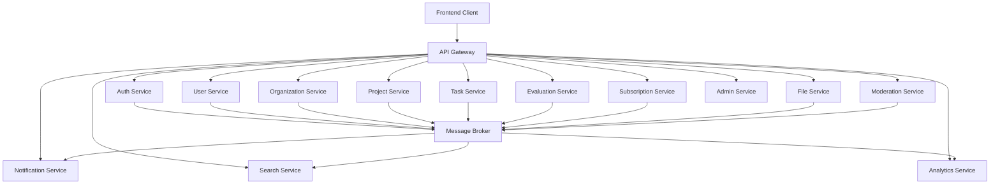
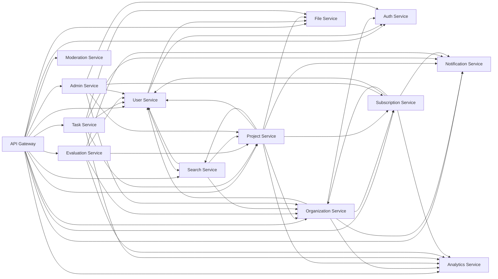

# CampusForge: микросервисная архитектура

## 1. Назначение документа

Документ описывает микросервисную архитектуру проекта **CampusForge**.

CampusForge — SaaS-платформа для университетов, студентов, преподавателей, менторов, компаний и проектных команд. Система поддерживает управление пользователями, организациями, рабочими пространствами, учебными группами, проектами, командами, задачами, оцениванием, уведомлениями, подписками, файлами, поиском, аналитикой, модерацией и администрированием.

Документ описывает:

- состав микросервисов;
- зоны ответственности сервисов;
- распределение таблиц базы данных;
- основные REST API каждого сервиса;
- события между сервисами;
- межсервисные зависимости;
- правила владения данными;
- инфраструктурные компоненты;
- рекомендуемую структуру репозитория.

---

## 2. Общий архитектурный подход

CampusForge использует сервисную архитектуру с единым входом через **API Gateway**.

Внешний API:

```text
REST API
```

Внутреннее взаимодействие:

```text
HTTP/gRPC для синхронных запросов
Message Broker для асинхронных событий
WebSocket для realtime-обновлений
```

Основные инфраструктурные компоненты:

```text
PostgreSQL
Redis
RabbitMQ или NATS
MinIO или S3-compatible storage
Nginx
Docker
```

---

## 3. Общая схема системы



---

## 4. Основные принципы

### 4.1. Владение данными

Каждый сервис отвечает за собственную предметную область и владеет своими таблицами.

```text
Auth Service отвечает за аутентификацию.
User Service отвечает за профили пользователей.
Organization Service отвечает за организации.
Project Service отвечает за проекты.
Task Service отвечает за задачи.
Evaluation Service отвечает за оценивание.
Notification Service отвечает за уведомления.
Subscription Service отвечает за подписки и лимиты.
```

Другие сервисы не изменяют напрямую чужие таблицы. Для взаимодействия используются API-запросы и события.

---

### 4.2. API Gateway

API Gateway — единая публичная точка входа в backend.

Задачи API Gateway:

- маршрутизация запросов;
- проверка JWT;
- передача контекста пользователя во внутренние сервисы;
- ограничение частоты запросов;
- настройка CORS;
- единый формат ошибок;
- логирование запросов;
- версионирование API;
- агрегация Swagger/OpenAPI-документации.

Основная маршрутизация:

```text
/api/v1/auth/**              -> Auth Service
/api/v1/users/**             -> User Service
/api/v1/organizations/**     -> Organization Service
/api/v1/projects/**          -> Project Service
/api/v1/tasks/**             -> Task Service
/api/v1/evaluations/**       -> Evaluation Service
/api/v1/notifications/**     -> Notification Service
/api/v1/subscriptions/**     -> Subscription Service
/api/v1/files/**             -> File Service
/api/v1/search/**            -> Search Service
/api/v1/analytics/**         -> Analytics Service
/api/v1/moderation/**        -> Moderation Service
/api/v1/admin/**             -> Admin Service
```

---

### 4.3. Контекст пользователя

После проверки JWT API Gateway передаёт внутренним сервисам контекст пользователя:

```http
X-User-Id: <uuid>
X-User-Role: user | moderator | admin
X-Request-Id: <uuid>
```

---

### 4.4. Обмен данными между сервисами

Синхронное взаимодействие:

```text
HTTP REST
gRPC
```

Асинхронное взаимодействие:

```text
RabbitMQ
NATS
Kafka
Redis Streams
```

Стандартный формат события:

```json
{
  "eventId": "fcb2c674-dc85-4061-a9c7-4f4a73abf61e",
  "eventType": "project.created",
  "source": "project-service",
  "occurredAt": "2026-06-22T16:40:00Z",
  "payload": {
    "projectId": "70f01b1c-d624-4c61-a5f3-87364e91d5e1",
    "createdByUserId": "1bb8eec1-2ed5-40a3-a4cf-9e30ecdf2d50"
  }
}
```

---

# 5. Список сервисов

| Сервис | Ответственность |
|---|---|
| API Gateway | Единая публичная точка входа |
| Auth Service | Регистрация, вход, JWT, refresh-токены, подтверждение email, восстановление пароля |
| User Service | Профили, студенческие и преподавательские данные, навыки, ссылки, документы |
| Organization Service | Университеты, факультеты, кафедры, компании, рабочие пространства, участники |
| Project Service | Проекты, участники, роли, заявки, приглашения, навыки, ссылки, документы |
| Task Service | Доски задач, колонки, задачи, исполнители, комментарии, вложения |
| Evaluation Service | Критерии, оценки проектов, баллы, отзывы |
| Notification Service | Уведомления, настройки, каналы доставки |
| Subscription Service | Тарифы, лимиты, подписки, использование, счета, платежи |
| File Service | Загрузка, хранение, скачивание и удаление файлов |
| Search Service | Поиск по пользователям, проектам, организациям и навыкам |
| Analytics Service | Статистика, отчёты и дашборды |
| Moderation Service | Проверка заявок, жалобы, блокировки, модерация контента |
| Admin Service | Системное администрирование платформы |

---

# 6. API Gateway

## 6.1. Ответственность

API Gateway принимает все внешние запросы от клиентских приложений и перенаправляет их во внутренние сервисы.

## 6.2. Основные функции

- проверка JWT;
- маршрутизация запросов;
- передача user context;
- rate limiting;
- логирование;
- обработка CORS;
- единый формат ошибок;
- агрегация документации.

## 6.3. Пример маршрутизации

```text
POST /api/v1/auth/login
-> Auth Service

GET /api/v1/projects
-> Project Service

GET /api/v1/notifications
-> Notification Service
```

---

# 7. Auth Service

## 7.1. Назначение

Auth Service управляет аутентификацией, безопасностью аккаунтов и системными ролями пользователей.

## 7.2. Таблицы сервиса

```text
users
refresh_tokens
email_verification_tokens
password_reset_tokens
```

## 7.3. Основной API

```http
POST   /api/v1/auth/register
POST   /api/v1/auth/login
POST   /api/v1/auth/logout
POST   /api/v1/auth/refresh
GET    /api/v1/auth/me

POST   /api/v1/auth/verify-email
POST   /api/v1/auth/resend-verification

POST   /api/v1/auth/forgot-password
POST   /api/v1/auth/reset-password
POST   /api/v1/auth/change-password
```

## 7.4. Основные события

| Событие | Описание |
|---|---|
| `user.registered` | Зарегистрирован новый пользователь |
| `user.email_verified` | Пользователь подтвердил email |
| `user.logged_in` | Пользователь вошёл в систему |
| `user.password_changed` | Пользователь изменил пароль |
| `user.blocked` | Пользователь заблокирован |
| `user.deleted` | Пользователь удалён |

## 7.5. Зависимости

| Сервис | Назначение |
|---|---|
| Notification Service | Отправка писем подтверждения и восстановления пароля |
| User Service | Инициализация профиля пользователя |
| Analytics Service | Метрики регистраций и активности |

---

# 8. User Service

## 8.1. Назначение

User Service управляет пользовательскими профилями, студенческими и преподавательскими данными, навыками, ссылками и документами пользователя.

## 8.2. Таблицы сервиса

```text
user_profiles
student_profiles
teacher_profiles
skills
user_skills
user_links
user_documents
```

## 8.3. Основной API

### Текущий пользователь

```http
GET    /api/v1/users/me
PATCH  /api/v1/users/me/profile
GET    /api/v1/users/me/skills
POST   /api/v1/users/me/skills
DELETE /api/v1/users/me/skills/{skillId}
GET    /api/v1/users/me/links
POST   /api/v1/users/me/links
PATCH  /api/v1/users/me/links/{linkId}
DELETE /api/v1/users/me/links/{linkId}
```

### Публичные профили

```http
GET    /api/v1/users/{userId}
GET    /api/v1/users/{userId}/profile
GET    /api/v1/users/{userId}/skills
GET    /api/v1/users/{userId}/links
GET    /api/v1/users/{userId}/documents
```

### Студенческий профиль

```http
GET    /api/v1/users/me/student-profile
POST   /api/v1/users/me/student-profile
PATCH  /api/v1/users/me/student-profile
```

### Профиль преподавателя

```http
GET    /api/v1/users/me/teacher-profile
POST   /api/v1/users/me/teacher-profile
PATCH  /api/v1/users/me/teacher-profile
```

### Документы пользователя

```http
GET    /api/v1/users/me/documents
POST   /api/v1/users/me/documents
GET    /api/v1/users/me/documents/{documentId}
PATCH  /api/v1/users/me/documents/{documentId}
DELETE /api/v1/users/me/documents/{documentId}
```

### Справочник навыков

```http
GET    /api/v1/skills
POST   /api/v1/skills
PATCH  /api/v1/skills/{skillId}
DELETE /api/v1/skills/{skillId}
```

## 8.4. Основные события

| Событие | Описание |
|---|---|
| `user.profile_created` | Создан профиль пользователя |
| `user.profile_updated` | Обновлён профиль пользователя |
| `user.skill_added` | Пользователю добавлен навык |
| `user.skill_removed` | У пользователя удалён навык |
| `user.document_uploaded` | Загружен документ пользователя |
| `user.document_deleted` | Удалён документ пользователя |

## 8.5. Зависимости

| Сервис | Назначение |
|---|---|
| Auth Service | Идентификация пользователя |
| Organization Service | Учебная группа и членство в организациях |
| File Service | Загрузка и хранение файлов |
| Search Service | Индексация пользователей |
| Analytics Service | Метрики пользователей |

---

# 9. Organization Service

## 9.1. Назначение

Organization Service управляет университетами, факультетами, кафедрами, компаниями, рабочими пространствами, доменами, контактами, учебными группами, членством и приглашениями.

## 9.2. Таблицы сервиса

```text
organizations
organization_domains
organization_requests
organization_workspaces
organization_links
organization_contacts
academic_groups
organization_memberships
organization_member_roles
user_invitations
roles
permissions
role_permissions
```

## 9.3. Основной API

### Организации

```http
GET    /api/v1/organizations
POST   /api/v1/organizations
GET    /api/v1/organizations/{organizationId}
PATCH  /api/v1/organizations/{organizationId}
DELETE /api/v1/organizations/{organizationId}
```

### Заявки на подключение организации

```http
POST   /api/v1/organization-requests
GET    /api/v1/organization-requests
GET    /api/v1/organization-requests/{requestId}
POST   /api/v1/organization-requests/{requestId}/approve
POST   /api/v1/organization-requests/{requestId}/reject
POST   /api/v1/organization-requests/{requestId}/cancel
```

### Рабочие пространства

```http
GET    /api/v1/organizations/{organizationId}/workspace
POST   /api/v1/organizations/{organizationId}/workspace
PATCH  /api/v1/organizations/{organizationId}/workspace
POST   /api/v1/organizations/{organizationId}/workspace/activate
POST   /api/v1/organizations/{organizationId}/workspace/suspend
POST   /api/v1/organizations/{organizationId}/workspace/close
```

### Участники организации

```http
GET    /api/v1/organizations/{organizationId}/members
POST   /api/v1/organizations/{organizationId}/members
GET    /api/v1/organizations/{organizationId}/members/{membershipId}
PATCH  /api/v1/organizations/{organizationId}/members/{membershipId}
DELETE /api/v1/organizations/{organizationId}/members/{membershipId}
```

### Роли участников

```http
GET    /api/v1/organizations/{organizationId}/members/{membershipId}/roles
POST   /api/v1/organizations/{organizationId}/members/{membershipId}/roles
DELETE /api/v1/organizations/{organizationId}/members/{membershipId}/roles/{roleId}
```

### Приглашения

```http
GET    /api/v1/organizations/{organizationId}/invitations
POST   /api/v1/organizations/{organizationId}/invitations
POST   /api/v1/organizations/invitations/{token}/accept
POST   /api/v1/organizations/invitations/{invitationId}/cancel
```

### Учебные группы

```http
GET    /api/v1/organizations/{organizationId}/academic-groups
POST   /api/v1/organizations/{organizationId}/academic-groups
GET    /api/v1/academic-groups/{groupId}
PATCH  /api/v1/academic-groups/{groupId}
DELETE /api/v1/academic-groups/{groupId}
```

## 9.4. Основные события

| Событие | Описание |
|---|---|
| `organization.created` | Создана организация |
| `organization.updated` | Организация обновлена |
| `organization.request_created` | Создана заявка организации |
| `organization.request_approved` | Заявка организации одобрена |
| `organization.request_rejected` | Заявка организации отклонена |
| `organization.workspace_created` | Создано рабочее пространство |
| `organization.member_invited` | Пользователь приглашён в организацию |
| `organization.member_joined` | Пользователь вступил в организацию |
| `organization.member_removed` | Пользователь удалён из организации |
| `organization.role_assigned` | Участнику назначена роль |
| `academic_group.created` | Создана учебная группа |

## 9.5. Зависимости

| Сервис | Назначение |
|---|---|
| Auth Service | Идентификация пользователя |
| User Service | Данные профиля участника |
| Notification Service | Уведомления о приглашениях |
| Subscription Service | Проверка лимитов workspace |
| Search Service | Индексация организаций |
| Analytics Service | Метрики организаций |

---

# 10. Project Service

## 10.1. Назначение

Project Service управляет проектами, участниками, ролями внутри проекта, заявками, приглашениями, навыками проекта, ссылками и проектными документами.

## 10.2. Таблицы сервиса

```text
projects
project_members
project_member_roles
project_applications
project_invitations
project_skills
project_links
project_documents
```

## 10.3. Основной API

### Проекты

```http
GET    /api/v1/projects
POST   /api/v1/projects
GET    /api/v1/projects/{projectId}
PATCH  /api/v1/projects/{projectId}
DELETE /api/v1/projects/{projectId}
POST   /api/v1/projects/{projectId}/publish
POST   /api/v1/projects/{projectId}/archive
POST   /api/v1/projects/{projectId}/complete
POST   /api/v1/projects/{projectId}/cancel
```

### Участники проекта

```http
GET    /api/v1/projects/{projectId}/members
POST   /api/v1/projects/{projectId}/members
GET    /api/v1/projects/{projectId}/members/{memberId}
PATCH  /api/v1/projects/{projectId}/members/{memberId}
DELETE /api/v1/projects/{projectId}/members/{memberId}
```

### Роли участников проекта

```http
GET    /api/v1/projects/{projectId}/members/{memberId}/roles
POST   /api/v1/projects/{projectId}/members/{memberId}/roles
DELETE /api/v1/projects/{projectId}/members/{memberId}/roles/{roleId}
```

### Заявки в проект

```http
GET    /api/v1/projects/{projectId}/applications
POST   /api/v1/projects/{projectId}/applications
POST   /api/v1/project-applications/{applicationId}/accept
POST   /api/v1/project-applications/{applicationId}/reject
POST   /api/v1/project-applications/{applicationId}/cancel
```

### Приглашения в проект

```http
GET    /api/v1/projects/{projectId}/invitations
POST   /api/v1/projects/{projectId}/invitations
POST   /api/v1/project-invitations/{invitationId}/accept
POST   /api/v1/project-invitations/{invitationId}/reject
POST   /api/v1/project-invitations/{invitationId}/cancel
```

### Навыки проекта

```http
GET    /api/v1/projects/{projectId}/skills
POST   /api/v1/projects/{projectId}/skills
DELETE /api/v1/projects/{projectId}/skills/{skillId}
```

### Ссылки проекта

```http
GET    /api/v1/projects/{projectId}/links
POST   /api/v1/projects/{projectId}/links
PATCH  /api/v1/projects/{projectId}/links/{linkId}
DELETE /api/v1/projects/{projectId}/links/{linkId}
```

### Документы проекта

```http
GET    /api/v1/projects/{projectId}/documents
POST   /api/v1/projects/{projectId}/documents
PATCH  /api/v1/projects/{projectId}/documents/{documentId}
DELETE /api/v1/projects/{projectId}/documents/{documentId}
```

## 10.4. Основные события

| Событие | Описание |
|---|---|
| `project.created` | Создан проект |
| `project.updated` | Проект обновлён |
| `project.published` | Проект опубликован |
| `project.completed` | Проект завершён |
| `project.archived` | Проект архивирован |
| `project.cancelled` | Проект отменён |
| `project.member_joined` | Пользователь присоединился к проекту |
| `project.member_removed` | Пользователь удалён из проекта |
| `project.application_created` | Создана заявка в проект |
| `project.application_accepted` | Заявка принята |
| `project.application_rejected` | Заявка отклонена |
| `project.invitation_created` | Создано приглашение в проект |
| `project.document_uploaded` | Загружен документ проекта |

## 10.5. Зависимости

| Сервис | Назначение |
|---|---|
| User Service | Данные участников и навыков |
| Organization Service | Проверка организации и членства |
| Subscription Service | Проверка лимитов проектов |
| File Service | Загрузка проектных документов |
| Notification Service | Уведомления о заявках и приглашениях |
| Search Service | Индексация проектов |
| Analytics Service | Метрики проектов |

---

# 11. Task Service

## 11.1. Назначение

Task Service управляет досками задач, колонками, задачами, исполнителями, комментариями и вложениями.

## 11.2. Таблицы сервиса

```text
task_boards
task_columns
tasks
task_assignees
task_comments
task_attachments
```

## 11.3. Основной API

### Доски

```http
GET    /api/v1/projects/{projectId}/boards
POST   /api/v1/projects/{projectId}/boards
GET    /api/v1/task-boards/{boardId}
PATCH  /api/v1/task-boards/{boardId}
DELETE /api/v1/task-boards/{boardId}
```

### Колонки

```http
GET    /api/v1/task-boards/{boardId}/columns
POST   /api/v1/task-boards/{boardId}/columns
PATCH  /api/v1/task-columns/{columnId}
DELETE /api/v1/task-columns/{columnId}
POST   /api/v1/task-columns/{columnId}/move
```

### Задачи

```http
GET    /api/v1/task-boards/{boardId}/tasks
POST   /api/v1/task-boards/{boardId}/tasks
GET    /api/v1/tasks/{taskId}
PATCH  /api/v1/tasks/{taskId}
DELETE /api/v1/tasks/{taskId}
POST   /api/v1/tasks/{taskId}/move
POST   /api/v1/tasks/{taskId}/complete
POST   /api/v1/tasks/{taskId}/reopen
```

### Исполнители

```http
GET    /api/v1/tasks/{taskId}/assignees
POST   /api/v1/tasks/{taskId}/assignees
DELETE /api/v1/tasks/{taskId}/assignees/{userId}
```

### Комментарии

```http
GET    /api/v1/tasks/{taskId}/comments
POST   /api/v1/tasks/{taskId}/comments
PATCH  /api/v1/task-comments/{commentId}
DELETE /api/v1/task-comments/{commentId}
```

### Вложения

```http
GET    /api/v1/tasks/{taskId}/attachments
POST   /api/v1/tasks/{taskId}/attachments
DELETE /api/v1/task-attachments/{attachmentId}
```

## 11.4. Основные события

| Событие | Описание |
|---|---|
| `task.board_created` | Создана доска задач |
| `task.column_created` | Создана колонка |
| `task.created` | Создана задача |
| `task.updated` | Задача обновлена |
| `task.moved` | Задача перемещена |
| `task.assigned` | Назначен исполнитель |
| `task.completed` | Задача завершена |
| `task.reopened` | Задача снова открыта |
| `task.comment_created` | Добавлен комментарий |
| `task.attachment_uploaded` | Загружено вложение |

## 11.5. Зависимости

| Сервис | Назначение |
|---|---|
| Project Service | Проверка проекта и участника |
| User Service | Данные исполнителя |
| File Service | Вложения к задачам |
| Notification Service | Уведомления по задачам |
| Analytics Service | Метрики задач |

---

# 12. Evaluation Service

## 12.1. Назначение

Evaluation Service управляет наборами критериев, критериями, оценками проектов, баллами и отзывами.

## 12.2. Таблицы сервиса

```text
evaluation_criteria_sets
evaluation_criteria
project_evaluations
project_evaluation_scores
project_reviews
```

## 12.3. Основной API

### Наборы критериев

```http
GET    /api/v1/evaluation/criteria-sets
POST   /api/v1/evaluation/criteria-sets
GET    /api/v1/evaluation/criteria-sets/{criteriaSetId}
PATCH  /api/v1/evaluation/criteria-sets/{criteriaSetId}
DELETE /api/v1/evaluation/criteria-sets/{criteriaSetId}
```

### Критерии

```http
GET    /api/v1/evaluation/criteria-sets/{criteriaSetId}/criteria
POST   /api/v1/evaluation/criteria-sets/{criteriaSetId}/criteria
PATCH  /api/v1/evaluation/criteria/{criterionId}
DELETE /api/v1/evaluation/criteria/{criterionId}
```

### Оценки

```http
GET    /api/v1/projects/{projectId}/evaluations
POST   /api/v1/projects/{projectId}/evaluations
GET    /api/v1/evaluations/{evaluationId}
PATCH  /api/v1/evaluations/{evaluationId}
POST   /api/v1/evaluations/{evaluationId}/submit
DELETE /api/v1/evaluations/{evaluationId}
```

### Баллы

```http
GET    /api/v1/evaluations/{evaluationId}/scores
POST   /api/v1/evaluations/{evaluationId}/scores
PATCH  /api/v1/evaluation-scores/{scoreId}
DELETE /api/v1/evaluation-scores/{scoreId}
```

### Отзывы

```http
GET    /api/v1/projects/{projectId}/reviews
POST   /api/v1/projects/{projectId}/reviews
PATCH  /api/v1/project-reviews/{reviewId}
DELETE /api/v1/project-reviews/{reviewId}
```

## 12.4. Основные события

| Событие | Описание |
|---|---|
| `evaluation.criteria_set_created` | Создан набор критериев |
| `evaluation.created` | Создана оценка |
| `evaluation.submitted` | Оценка отправлена |
| `evaluation.score_updated` | Балл оценки обновлён |
| `review.created` | Создан отзыв |
| `review.updated` | Отзыв обновлён |

## 12.5. Зависимости

| Сервис | Назначение |
|---|---|
| Project Service | Проверка проекта |
| User Service | Данные оценщика и оцениваемого пользователя |
| Organization Service | Проверка роли в организации |
| Notification Service | Уведомления об оценках |
| Analytics Service | Метрики оценивания |

---

# 13. Notification Service

## 13.1. Назначение

Notification Service управляет уведомлениями внутри платформы, настройками уведомлений и историей доставки.

## 13.2. Таблицы сервиса

```text
notifications
notification_settings
notification_deliveries
```

## 13.3. Основной API

### Уведомления

```http
GET    /api/v1/notifications
GET    /api/v1/notifications/unread-count
GET    /api/v1/notifications/{notificationId}
POST   /api/v1/notifications/{notificationId}/read
POST   /api/v1/notifications/read-all
DELETE /api/v1/notifications/{notificationId}
```

### Настройки

```http
GET    /api/v1/notification-settings
PATCH  /api/v1/notification-settings
```

### Внутренний API отправки

```http
POST   /api/v1/internal/notifications
POST   /api/v1/internal/notifications/bulk
```

## 13.4. Обрабатываемые события

| Событие | Уведомление |
|---|---|
| `organization.member_invited` | Приглашение в организацию |
| `project.application_created` | Новая заявка в проект |
| `project.application_accepted` | Заявка принята |
| `project.invitation_created` | Приглашение в проект |
| `task.assigned` | Назначение задачи |
| `task.comment_created` | Новый комментарий к задаче |
| `evaluation.submitted` | Получена оценка проекта |
| `subscription.expiring_soon` | Напоминание об окончании подписки |

## 13.5. Каналы доставки

```text
in_app
email
telegram
push
```

---

# 14. Subscription Service

## 14.1. Назначение

Subscription Service управляет тарифами, лимитами тарифов, подписками, счётчиками использования, счетами и платежами.

## 14.2. Таблицы сервиса

```text
subscription_plans
subscription_plan_limits
subscriptions
usage_counters
invoices
payments
```

## 14.3. Основной API

### Тарифы

```http
GET    /api/v1/subscription-plans
POST   /api/v1/subscription-plans
GET    /api/v1/subscription-plans/{planId}
PATCH  /api/v1/subscription-plans/{planId}
DELETE /api/v1/subscription-plans/{planId}
```

### Лимиты тарифов

```http
GET    /api/v1/subscription-plans/{planId}/limits
POST   /api/v1/subscription-plans/{planId}/limits
PATCH  /api/v1/subscription-plan-limits/{limitId}
DELETE /api/v1/subscription-plan-limits/{limitId}
```

### Подписки

```http
GET    /api/v1/subscriptions
POST   /api/v1/subscriptions
GET    /api/v1/subscriptions/{subscriptionId}
PATCH  /api/v1/subscriptions/{subscriptionId}
POST   /api/v1/subscriptions/{subscriptionId}/cancel
POST   /api/v1/subscriptions/{subscriptionId}/renew
```

### Использование лимитов

```http
GET    /api/v1/subscriptions/current/usage
GET    /api/v1/organizations/{organizationId}/usage
POST   /api/v1/internal/usage/increment
POST   /api/v1/internal/usage/decrement
POST   /api/v1/internal/usage/check-limit
```

### Счета и платежи

```http
GET    /api/v1/invoices
GET    /api/v1/invoices/{invoiceId}
POST   /api/v1/invoices/{invoiceId}/pay

GET    /api/v1/payments
GET    /api/v1/payments/{paymentId}
```

## 14.4. Основные события

| Событие | Описание |
|---|---|
| `subscription.created` | Создана подписка |
| `subscription.activated` | Подписка активирована |
| `subscription.cancelled` | Подписка отменена |
| `subscription.expired` | Подписка истекла |
| `usage.limit_exceeded` | Превышен лимит использования |
| `invoice.created` | Создан счёт |
| `payment.succeeded` | Платёж прошёл |
| `payment.failed` | Платёж не прошёл |

## 14.5. Зависимости

| Сервис | Назначение |
|---|---|
| User Service | Проверка пользователя-подписчика |
| Organization Service | Проверка организации-подписчика |
| Notification Service | Уведомления по подпискам |
| Analytics Service | Метрики выручки и использования |

---

# 15. File Service

## 15.1. Назначение

File Service управляет загрузкой, хранением, скачиванием и удалением файлов.

Файлы не хранятся в реляционной базе данных. В доменных таблицах хранятся только метаданные:

```text
storage_key
original_filename
mime_type
file_size_bytes
```

Варианты хранилища:

```text
MinIO
Amazon S3
Yandex Object Storage
local storage
```

## 15.2. Основной API

```http
POST   /api/v1/files/upload
GET    /api/v1/files/{fileId}
GET    /api/v1/files/{fileId}/download
DELETE /api/v1/files/{fileId}

POST   /api/v1/files/presigned-upload-url
POST   /api/v1/files/presigned-download-url
```

## 15.3. Основные события

| Событие | Описание |
|---|---|
| `file.uploaded` | Файл загружен |
| `file.deleted` | Файл удалён |
| `file.scan_failed` | Файл не прошёл проверку |
| `file.too_large` | Превышен лимит размера файла |

## 15.4. Используется сервисами

```text
User Service
Organization Service
Project Service
Task Service
```

---

# 16. Search Service

## 16.1. Назначение

Search Service предоставляет поиск по пользователям, навыкам, организациям и проектам.

## 16.2. Поисковое хранилище

```text
PostgreSQL full-text search
Elasticsearch
OpenSearch
Meilisearch
Typesense
```

## 16.3. Основной API

```http
GET /api/v1/search
GET /api/v1/search/users
GET /api/v1/search/projects
GET /api/v1/search/organizations
GET /api/v1/search/skills
```

## 16.4. Индексируемые события

| Событие | Индексируемые данные |
|---|---|
| `user.profile_updated` | Профиль пользователя |
| `user.skill_added` | Навыки пользователя |
| `project.created` | Проект |
| `project.updated` | Проект |
| `organization.created` | Организация |
| `organization.updated` | Организация |

---

# 17. Analytics Service

## 17.1. Назначение

Analytics Service предоставляет статистику, отчёты и дашборды.

## 17.2. Основной API

```http
GET /api/v1/analytics/platform/overview
GET /api/v1/analytics/organizations/{organizationId}/overview
GET /api/v1/analytics/organizations/{organizationId}/projects
GET /api/v1/analytics/organizations/{organizationId}/students
GET /api/v1/analytics/organizations/{organizationId}/tasks
GET /api/v1/analytics/organizations/{organizationId}/evaluations
GET /api/v1/analytics/projects/{projectId}
GET /api/v1/analytics/users/{userId}/activity
```

## 17.3. Обрабатываемые события

```text
user.registered
organization.member_joined
project.created
project.completed
task.created
task.completed
evaluation.submitted
subscription.created
payment.succeeded
```

---

# 18. Moderation Service

## 18.1. Назначение

Moderation Service управляет проверкой заявок организаций, жалобами, блокировками пользователей, скрытием проектов и действиями модерации.

## 18.2. Возможные таблицы сервиса

```text
moderation_reports
moderation_actions
```

## 18.3. Основной API

```http
GET    /api/v1/moderation/organization-requests
POST   /api/v1/moderation/organization-requests/{requestId}/approve
POST   /api/v1/moderation/organization-requests/{requestId}/reject

GET    /api/v1/moderation/reports
POST   /api/v1/moderation/reports
GET    /api/v1/moderation/reports/{reportId}
POST   /api/v1/moderation/reports/{reportId}/resolve
POST   /api/v1/moderation/reports/{reportId}/reject

POST   /api/v1/moderation/users/{userId}/block
POST   /api/v1/moderation/users/{userId}/unblock
POST   /api/v1/moderation/projects/{projectId}/hide
POST   /api/v1/moderation/projects/{projectId}/restore
POST   /api/v1/moderation/organizations/{organizationId}/block
POST   /api/v1/moderation/organizations/{organizationId}/unblock
```

## 18.4. Основные события

| Событие | Описание |
|---|---|
| `moderation.report_created` | Создана жалоба |
| `moderation.report_resolved` | Жалоба обработана |
| `moderation.user_blocked` | Пользователь заблокирован |
| `moderation.project_hidden` | Проект скрыт |
| `moderation.organization_blocked` | Организация заблокирована |

---

# 19. Admin Service

## 19.1. Назначение

Admin Service предоставляет системные административные операции.

## 19.2. Основной API

```http
GET    /api/v1/admin/overview

GET    /api/v1/admin/users
GET    /api/v1/admin/users/{userId}
PATCH  /api/v1/admin/users/{userId}
POST   /api/v1/admin/users/{userId}/block
POST   /api/v1/admin/users/{userId}/unblock
POST   /api/v1/admin/users/{userId}/change-system-role

GET    /api/v1/admin/organizations
GET    /api/v1/admin/organizations/{organizationId}
PATCH  /api/v1/admin/organizations/{organizationId}

GET    /api/v1/admin/projects
GET    /api/v1/admin/projects/{projectId}

GET    /api/v1/admin/subscriptions
GET    /api/v1/admin/payments

GET    /api/v1/admin/audit-logs
```

## 19.3. Зависимости

```text
Auth Service
User Service
Organization Service
Project Service
Subscription Service
Analytics Service
Moderation Service
```

---

# 20. Распределение таблиц по сервисам

| Таблица | Сервис-владелец |
|---|---|
| users | Auth Service |
| refresh_tokens | Auth Service |
| email_verification_tokens | Auth Service |
| password_reset_tokens | Auth Service |
| user_profiles | User Service |
| student_profiles | User Service |
| teacher_profiles | User Service |
| skills | User Service |
| user_skills | User Service |
| user_links | User Service |
| user_documents | User Service |
| organizations | Organization Service |
| organization_domains | Organization Service |
| organization_requests | Organization Service |
| organization_workspaces | Organization Service |
| organization_links | Organization Service |
| organization_contacts | Organization Service |
| academic_groups | Organization Service |
| organization_memberships | Organization Service |
| organization_member_roles | Organization Service |
| user_invitations | Organization Service |
| roles | Organization Service / Access Control |
| permissions | Organization Service / Access Control |
| role_permissions | Organization Service / Access Control |
| projects | Project Service |
| project_members | Project Service |
| project_member_roles | Project Service |
| project_applications | Project Service |
| project_invitations | Project Service |
| project_skills | Project Service |
| project_links | Project Service |
| project_documents | Project Service |
| task_boards | Task Service |
| task_columns | Task Service |
| tasks | Task Service |
| task_assignees | Task Service |
| task_comments | Task Service |
| task_attachments | Task Service |
| evaluation_criteria_sets | Evaluation Service |
| evaluation_criteria | Evaluation Service |
| project_evaluations | Evaluation Service |
| project_evaluation_scores | Evaluation Service |
| project_reviews | Evaluation Service |
| notifications | Notification Service |
| notification_settings | Notification Service |
| notification_deliveries | Notification Service |
| subscription_plans | Subscription Service |
| subscription_plan_limits | Subscription Service |
| subscriptions | Subscription Service |
| usage_counters | Subscription Service |
| invoices | Subscription Service |
| payments | Subscription Service |
| moderation_reports | Moderation Service |
| moderation_actions | Moderation Service |

---

# 21. Каталог основных событий

## 21.1. События пользователей

```text
user.registered
user.email_verified
user.logged_in
user.profile_created
user.profile_updated
user.skill_added
user.skill_removed
user.document_uploaded
user.document_deleted
user.blocked
user.deleted
```

## 21.2. События организаций

```text
organization.created
organization.updated
organization.request_created
organization.request_approved
organization.request_rejected
organization.workspace_created
organization.member_invited
organization.member_joined
organization.member_removed
organization.role_assigned
academic_group.created
```

## 21.3. События проектов

```text
project.created
project.updated
project.published
project.completed
project.archived
project.cancelled
project.member_joined
project.member_removed
project.application_created
project.application_accepted
project.application_rejected
project.invitation_created
project.document_uploaded
```

## 21.4. События задач

```text
task.board_created
task.column_created
task.created
task.updated
task.moved
task.assigned
task.completed
task.reopened
task.comment_created
task.attachment_uploaded
```

## 21.5. События оценивания

```text
evaluation.criteria_set_created
evaluation.created
evaluation.submitted
evaluation.score_updated
review.created
review.updated
```

## 21.6. События подписок

```text
subscription.created
subscription.activated
subscription.cancelled
subscription.expired
usage.limit_exceeded
invoice.created
payment.succeeded
payment.failed
```

## 21.7. События файлов

```text
file.uploaded
file.deleted
file.scan_failed
file.too_large
```

## 21.8. События модерации

```text
moderation.report_created
moderation.report_resolved
moderation.user_blocked
moderation.project_hidden
moderation.organization_blocked
```

---

# 22. Межсервисные зависимости



---

# 23. Роли и контроль доступа

## 23.1. Глобальные роли

Хранятся в таблице:

```text
users.system_role
```

Значения:

```text
user
moderator
admin
```

## 23.2. Роли в организации

Хранятся через таблицы:

```text
organization_memberships
organization_member_roles
roles
```

Примеры ролей:

```text
student
teacher
university_admin
department_admin
company_representative
```

## 23.3. Роли в проекте

Хранятся через таблицы:

```text
project_members
project_member_roles
```

Примеры ролей:

```text
project_owner
project_captain
project_member
project_mentor
project_supervisor
project_reviewer
project_jury
```

## 23.4. Проверка доступа

Каждый сервис проверяет права доступа внутри своей предметной области.

Примеры:

```text
Project Service проверяет права на редактирование проекта.
Task Service проверяет участие пользователя в проекте перед изменением задач.
Evaluation Service проверяет права оценщика.
Organization Service проверяет права администратора workspace.
Subscription Service проверяет права управления подпиской.
Admin Service проверяет системную роль admin.
```

---

# 24. Стратегия хранения данных

## 24.1. Базы данных сервисов

Каждый сервис имеет собственную логическую область данных.

```text
auth_db
user_db
organization_db
project_db
task_db
evaluation_db
notification_db
subscription_db
search_db
analytics_db
moderation_db
```

## 24.2. PostgreSQL schemas

Один экземпляр PostgreSQL может быть разделён на схемы:

```sql
CREATE SCHEMA auth;
CREATE SCHEMA users;
CREATE SCHEMA organizations;
CREATE SCHEMA projects;
CREATE SCHEMA tasks;
CREATE SCHEMA evaluations;
CREATE SCHEMA notifications;
CREATE SCHEMA subscriptions;
CREATE SCHEMA moderation;
```

## 24.3. Хранение файлов

Файлы хранятся в объектном хранилище.

```text
MinIO
S3-compatible storage
local storage
```

В реляционной базе хранятся только метаданные файлов и `storage_key`.

---

# 25. Структура репозитория

## 25.1. Monorepo

```text
campusforge/
  apps/
    api-gateway/
    auth-service/
    user-service/
    organization-service/
    project-service/
    task-service/
    evaluation-service/
    notification-service/
    subscription-service/
    file-service/
    search-service/
    analytics-service/
    moderation-service/
    admin-service/
  libs/
    common/
    contracts/
    config/
    database/
    logger/
    auth/
    events/
  docker-compose.yml
  README.md
```

## 25.2. Общие библиотеки

```text
libs/common       общие утилиты, базовые DTO, пагинация, ошибки
libs/contracts    контракты событий и общие интерфейсы
libs/config       конфигурация окружения
libs/database     database helpers и Prisma clients
libs/logger       модуль логирования
libs/auth         JWT guards, decorators, permission utilities
libs/events       event publisher и subscriber helpers
```

---

# 26. Инфраструктурные компоненты

## 26.1. Полный состав сервисов

```text
api-gateway
auth-service
user-service
organization-service
project-service
task-service
evaluation-service
notification-service
subscription-service
file-service
search-service
analytics-service
moderation-service
admin-service
postgres
redis
rabbitmq
minio
nginx
```

## 26.2. Пример Docker Compose

```yaml
services:
  api-gateway:
    build: ./apps/api-gateway
    depends_on:
      - auth-service
      - user-service
      - organization-service
      - project-service

  auth-service:
    build: ./apps/auth-service
    depends_on:
      - postgres
      - redis

  user-service:
    build: ./apps/user-service
    depends_on:
      - postgres
      - rabbitmq

  organization-service:
    build: ./apps/organization-service
    depends_on:
      - postgres
      - rabbitmq

  project-service:
    build: ./apps/project-service
    depends_on:
      - postgres
      - rabbitmq

  task-service:
    build: ./apps/task-service
    depends_on:
      - postgres
      - rabbitmq

  evaluation-service:
    build: ./apps/evaluation-service
    depends_on:
      - postgres
      - rabbitmq

  notification-service:
    build: ./apps/notification-service
    depends_on:
      - postgres
      - rabbitmq
      - redis

  subscription-service:
    build: ./apps/subscription-service
    depends_on:
      - postgres
      - rabbitmq

  file-service:
    build: ./apps/file-service
    depends_on:
      - minio

  search-service:
    build: ./apps/search-service
    depends_on:
      - postgres
      - rabbitmq

  analytics-service:
    build: ./apps/analytics-service
    depends_on:
      - postgres
      - rabbitmq

  moderation-service:
    build: ./apps/moderation-service
    depends_on:
      - postgres
      - rabbitmq

  admin-service:
    build: ./apps/admin-service
    depends_on:
      - auth-service
      - user-service
      - organization-service
      - project-service

  postgres:
    image: postgres:16

  redis:
    image: redis:7

  rabbitmq:
    image: rabbitmq:3-management

  minio:
    image: minio/minio

  nginx:
    image: nginx:alpine
```

---

# 27. Итоговое распределение ответственности

| Домен | Сервис |
|---|---|
| Аутентификация | Auth Service |
| Профили пользователей | User Service |
| Организации и участники | Organization Service |
| Проекты и команды | Project Service |
| Доски и задачи | Task Service |
| Оценки и отзывы | Evaluation Service |
| Уведомления | Notification Service |
| Тарифы, лимиты и платежи | Subscription Service |
| Файлы | File Service |
| Поиск | Search Service |
| Аналитика | Analytics Service |
| Модерация | Moderation Service |
| Системное управление | Admin Service |

---

# 28. Финальная архитектура

CampusForge использует следующую backend-архитектуру:

```text
External API: REST
Entry point: API Gateway
Backend style: Domain services
Authentication: JWT + refresh tokens
Authorization: global roles + organization roles + project roles
Database: PostgreSQL
Cache: Redis
Events: RabbitMQ or NATS
Files: MinIO or S3-compatible storage
Realtime: WebSocket
Deployment: Docker + Nginx
```

Система разделена на независимые сервисы по предметным областям. Каждый сервис владеет своими данными, предоставляет собственный API, публикует доменные события и обрабатывает события других сервисов при необходимости.
